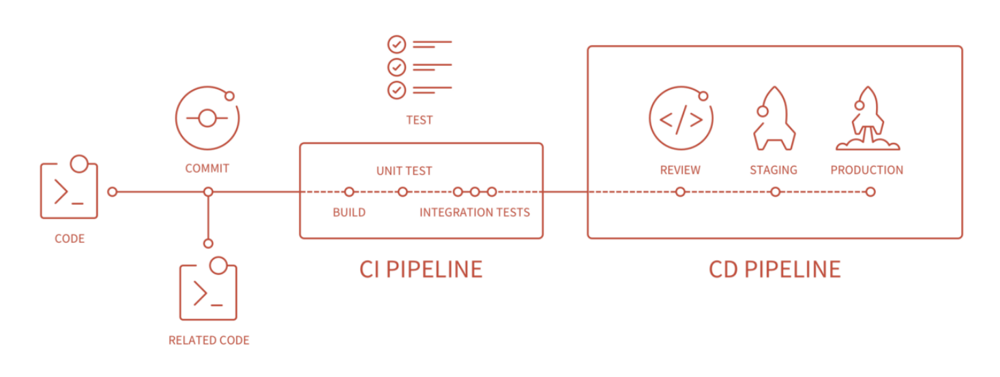
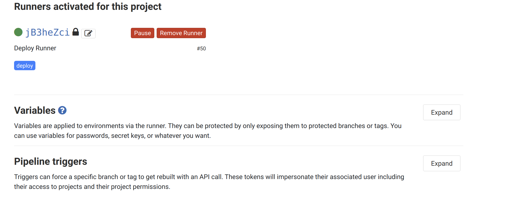
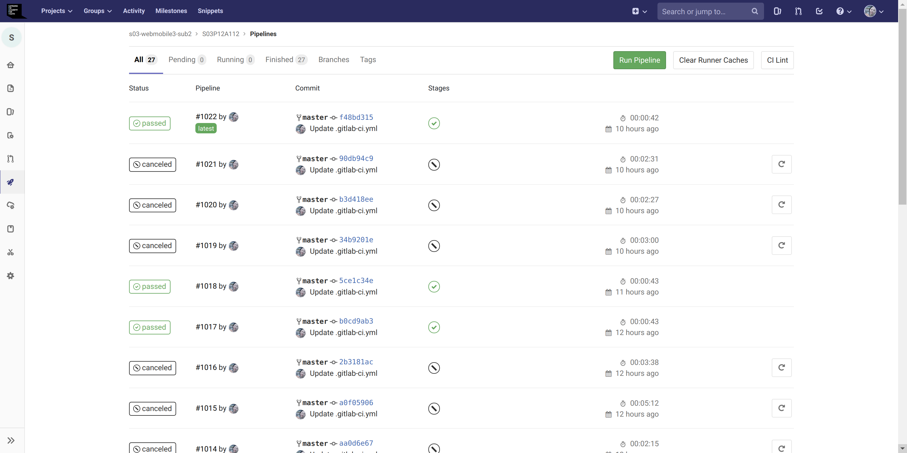
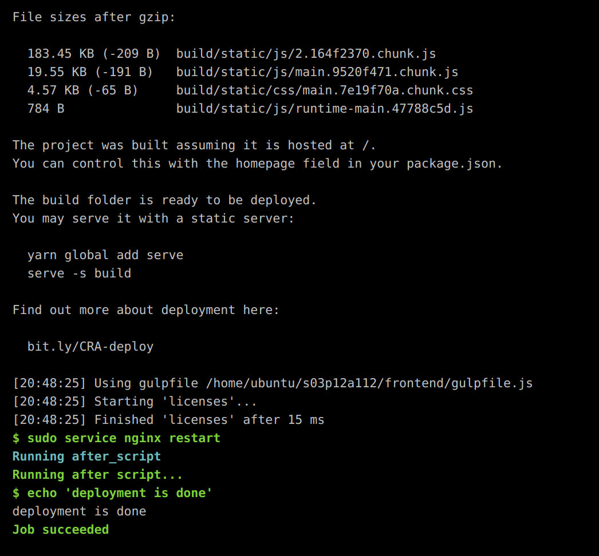

# Configuring GitLab CI/CD with AWS EC2

> 배포 자동화를 통해 비효율 끝판왕 개선하기!!
>
> [지난번](https://github.com/chloe-codes1/TIL/blob/master/Server/Deployment/Deploying_a_SpringBoot-React_project_on_AWS_EC2.md)에 배포한 SSAFY에서 준 EC2 하나에 backend와 frontend server 두 개를 올리는 방식에서, 재배포 시 git repo pull 받고 일련의 배포 명령어를 주르륵 실행해야 했고, 너무 비효율적이라 빨리 고치고 싶었다.
>
> 그래서 CI/CD 를 알아보던 중, SSAFY에서 Github이 아닌 GitLab을 활용하고 있는 만큼 GitLab이 만든 Gitlab CI/CD를 활용해서 배포 자동화를 해보기로 했다!
>
> References: [namioto.ip.or.kr](https://namioto.ip.or.kr/2018/07/16/gitlab-ci%EB%A1%9C-%EC%9E%90%EB%8F%99%EB%B0%B0%ED%8F%AC%ED%95%98%EA%B8%B0/)

<br>

## 0. Getting started with GitLab CI/CD

<br>



### GitLab CI/CD 란?

- GitLab CI/CD는 Docker container위에서 작동되고, 연결된 Kubernetes 에 배포된다
- Project root에 `gitlab-ci.yml` 파일이 있는 상태에서 push가 들어오면, 해당 파일에 명시된 **Pipeline** (task 묶음)이 실행된다

<br>

### Pipeline의 구성

- `Test`
  - Unit Test
  - 통합 Test
  - E2E Test
  - Test Coverage 측정
- `Lint`
  - Code quality 측정
  - Code convention 점검
- `Build`
  - Build
  - Bundling
  - Dockerfile build
  - Container registry push
- `Deploy`
  - Helm Chart
    - **Helm Chart**란?
      - `helm`은 Kubernetes package manager
      - `helm chart`는 pacakage format으로 application을 설치하기 위한 파일들로 구성됨!
  - KNative Functions
    - **KNative**란?
      - Serverless cloud native application을 배포, 실행, 관리하기 위해 Kubernetes에 구성 요소를 추가하는 Open source community project
  - KNative App(컨테이너) 배포

<br>

<br>

## 1. GitLab Runner

- Gitlab Runner는 remote branch에 push가 되면 설정된 Stage위의 작업들을 실행해준다!
- 그러기 위해서는 원격 저장소에 `GitLab Runner`가 설치되어 있어야 한다

<br>

### 1-1. GitLab 공식 repository 추가

```bash
curl -L https://packages.gitlab.com/install/repositories/runner/gitlab-runner/script.deb.sh | sudo bash
```

<br>

### 1-2. GitLab Runner 최신 버전 설치

``` bash
sudo apt-get install gitlab-runner
```

<br>

### 1-3. Registering Runners

> root 계정에서 바로 실행하려면 1 ~ 2 번 건너뛰기!

#### 1. 계정 생성

```bash
sudo useradd --comment 'GitLab Runner' --create-home gitlab-runner --shell /bin/bash
```

- `gitlab-runner` 라는 이름의 계정을 생성한다

#### 2. 설치

``` bash
sudo gitlab-runner install --user=gitlab-runner --working-directory=/home/gitlab-runner
```

#### 3. 실행

``` bash
sudo gitlab-runner start
```

#### 4. Gitlab Runner 등록

``` bash
sudo gitlab-runner register
```

- 위의 명령어를 입력하고, 5가지 사항을 interactive하게 입력해야 한다

  ```bash
  # 1. Gitlab 서버 주소 입력
  Please enter the gitlab-ci coordinator URL (e.g. https://gitlab.com )
  
  # 2. Gitlab CI Token 입력 
  #   -> Settings > CI/CD > Runners settings > Specific Runners 에서 확인 가능!
  Please enter the gitlab-ci token for this runner:
  
  # 3. Runner 설명 입력
  Please enter the gitlab-ci description for this runner:
  
  # 4. Runner Tag 설정
  #   -> gitlab-ci.yml 파일에 적어야 하므로 기억하자!!!!!! 중요!!!!
  Please enter the gitlab-ci tags for this runner (comma separated):
  
  # 5. Runner가 어떤 작업으로 동작할 지 설정 
  #   -> 나는 Shell Script 쓰러갈서 Shell 을 선택했다
  Please enter the executor: docker-ssh, ssh, virtualbox, docker, parallels, shell, docker+machine, docker-ssh+machine, kubernetes:
  ```

<br>

### 1-4. 등록된 Runner 확인하기

- **Settings > CI/CD > Runners settings > Specific Runners**  에서 아래와 같이 등록된 Runner를 확인할 수 있다



<br>

<br>

## 2. `.gitlab-ci.yml` 파일 작성하기

> Project root 에 `.gitlab-ci.yml` 파일을 작성한다

<br>

#### 주의

- 이것은 SpringBoot - React 프로젝트의 배포 자동화를 위해 내가 작성한 script 이다!!
- 이 yml 파일 하나를 만들기 위해 엄청나게 많은 시행착오를 겪어서 나온 결과이지만, 처음 작성해보는 Gitlab CI/CD 파일이고, 더 나은 방법이 있을 수 있으므로 참고만 하자! (아마 있을 것이다! 계속 알아보고 있다!)
  - 더 효율적인 방법을 찾으면 update 하겠다!!

ex)

```yaml
deploy-to-server:
  stage: deploy
  only:
    - master
  before_script:
    - echo 'start deployment'
    - whoami
  script:
    - cd /home/ubuntu/s03p12a112/
    - git pull origin master
    - cd backend
    - kill $(lsof -t -i:8000)
    - sudo mvn package
    - cd /home/ubuntu/s03p12a112/backend/target/
    - setsid nohup java -jar backend-0.0.1-SNAPSHOT.jar > /dev/null 2>&1 &
    - cd /home/ubuntu/s03p12a112/frontend/
    - sudo npm install
    - sudo npm run build
    - sudo service nginx restart
  after_script:
    - echo 'deployment is done'
  tags:
    - deploy
```

<br>

### yaml 파일 설명

- `deploy-to-server`
  - Gitlab Runner를 등록 할 때 지어준 JOB 이름
- `stage`
  - 이 글의 위에서 설명한 바와 같이 Gitlab은 Stage 별로 특정 작업들을 수행할 수 있는 그룹이 있는데, 그 중 **deploy** stage 라는 것
- `only`
  - **master** branch에 event가 발생 했을 때에만 **pipeline** 이 활성화 되게 설정
- `before_script`
  - 말그대로 runner에 의해 실행될 shell script 실행 이전에 수행 될 script
    - `whoami` 명령어
      - Gitlab Runner를 등록 할 때 Root 계정이 아닌 따로 만든 계정 (`gitlab-runner`) 으로 등록했기 때문에 제대로 설정되어있나 보려고 추가함!
- `script`
  - Gitlab Runner에 의해 실행될 Shell script
  - backend build 후 재배포, front build 후 재배포 하는 순서로 실행된다!
    - `kill $(lsof -t -i:8000)`
      - backend server가 사용하고 있는 포트번호인 8000번 포트를 종료한다
    - `setsid nohup java -jar backend-0.0.1-SNAPSHOT.jar > /dev/null 2>&1 &`
    - 가장 많이 시행 착오 겪은 부분이다
      - 처음에 기존 jar 파일을 background에서 실행 시키도록 `nohup -jar backend-0.0.1-SNAPSHOT.jar &` 로 pipeline을 활성화 시켰더니 Job이 종료되지 않고 계속 실행되었다
      - `nohup -jar backend-0.0.1-SNAPSHOT.jar > nohup.out &` 로 변경했더니 permission denied error 가 났다
      - 그 후로도 수정에 수정을 거쳐 결국 linux directory structure에서 장치 파일들이 저장되는 가상의 파일시스템인 `/dev` 로 .out 파일을 작성하게 변경하였다 (실제로 작성되지는 않는다! 물리적 용량을 차지하지 않는 directory 임!)
      - 그 결과, Runner의 Job이 성공적으로 종료되고, background에서 Jar 파일이 실행되는 것을 확인 할 수 있었다!
- `after_script`
  - 말 그대로 script 수행이 완료되면 수행 될 script
- `tags`
  - 특정 Tag가 달린 Runner에 명령을 내릴 수 있게 한다
    - Gitlab Runner 등록 시 설정한 Tag를 잘 기억해 두었다가 여기에 적으면 된다!

<br>

<br>

## 3. Pipeline 실행시키기

> `.gitlab-ci.yml` 파일에 기재했듯이, master branch에 event가 발생하면 pipeline이 실행된다

<br>

### Job 실행 결과 확인

- **CI/CD > Pipelines** 에서 실행된 pipeline들을 확인 할 수 있다



<br>

- **Pipeline** 을 클릭해서 들어가면 실행된 **Job** 을 확인 할 수 있다
- Job이 성공적으로 실행되면 아래와 같은 화면을 볼 수 있다



<br>

*Job succeeded!*

<br>

<br>

<br>

`+`

## gitlab-runner 계정에 Sudo 권한 부여하기

<br>

처음에 Job 실행 시 새로 생성한 `gitlab-runner`  계정에 대한 sudo 권한이 없어서 권한을 부여했다

```bash
sudo visudo
```

- 위의 명령어를 입력한 뒤 아래의 내용을 추가했다

  ```
  gitlab-runner ALL=(ALL) NOPASSWD: ALL
  ```

<br>

<br>

`+`

### Todos

- 이 방식 말고 `Dockerfile` 을 작성하고 docker image를 실행시키는 Job을 Gitlab CI/CD로 설정하는 방법을 생각해보고 있다!
- Kubernetes를 활용하는 방법도 알아보는 중! 재밌당!
