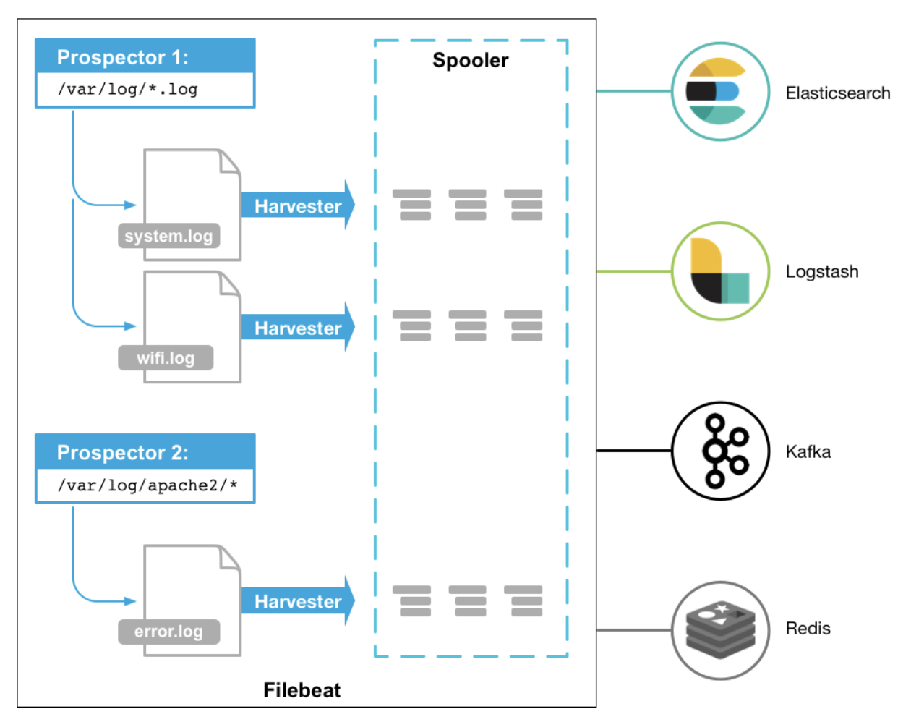

# Filebeat Basics

> Filebeat에 대해 알아보아요우
>
> Reference: [filebeat docs](https://www.elastic.co/guide/en/beats/filebeat/6.0/filebeat-overview.html)

<br>

<br>

## What is Filebeat?

<br>

### Filebeat

- **Log data** 를 **전달** 하고, **중앙화** 하기 위한 경량의 `Producer`
- Server에 agent로 설치되는 `Filebeat` 는
  1. Directory 혹은 특정 file을 **monitoring** 하고,
  2. log event를 **수집** 하고,
  3. **Indexing** 을 위해 `ElasicSearch` 또는 `Logstash` 로 전달한다

<br>



<br>

<br>

### How it works?

1. Filebeat를 시작하면 설정에서 지정한 **log data** 를 바라보는 하나 이상의 **prospector** 를 가진다
2. 지정한 **log file** 에서 event가 발생할 때마다 `Filebeat` 는 **data 수확기 (`harvester`)** 를 시작한다
3. 하나의 **log file** 을 바라보는 각 **harvester** 는 새 log data를 읽고, `libbeat` 에 보낸다
4. `libbeat` 는 이벤트를 집계하고, 집계된 data를 `Filebeat` 설정에 구성된 출력으로 data를 보낸다

<br>

<br>

## How Filebeat works (in detail)

<br>

- Filebeat는 `prospector` 와 `harvester` 로 구성되어 있다
  - 두 가지 components 들이 함께 file을 추적하고, 지정한 곳으로 **event data** 를 전달한다

<br>

### What is a `harvester`?

- **Harvester**는 file의 내용을 읽는 역할을 한다
- 각 파일을 한 줄씩 읽으면서 내용을 보낸다
- 하나의 파일당 하나의 Harvester가 작업을 시작하고, 끝낸다
  - 즉, Harvester가 작동하는동안 **file descriptor** 는 열려있고, harvester는 계속해서 파일을 읽는다
    - `Cons`
      - harvester가 작업을 끝낼 때까지 disk 공간을 차지한다는 단점이 있다!

<br>

### What is a `prospector`?

- **Prospector** 는 **harvester** 를 **관리**하고, 읽어들일 자원을 **찾는** 역할을 한다

- 만약 `input` 이 **log** 라면 prospector는

  1. 해당 경로의 모든 파일을 찾고
  2. **harvester** 를 각 파일에서 실행시킨다

- `Filebeat` 가 기재된 특정 경로로부터 읽을 모든 **log file** 을 설정하는 예시

  - ex)

    ```yml
    filebeat.prospectors:
    - type: log
     paths:
      - /var/log/*.log
      - /var/path2/*.log
    ```

- Filebeat는 현재 **prospector** type으로 `log` 와 `stdin` 을 지원한다

- Filebeat **prospector** 는 오직 **local file** 만 읽을 수 있다!

  - Remote host 에 연결하여 파일이나 log를 읽을 수 없다!!

<br>

### How does Filebeat keep the state of files?

- Filebeat는 각 파일의 **state**를 추적하고 disk의 registry file에 저장한다
  - **state**는
    1. harvest가 마지막으로 읽고있던 곳을 **기억**하고,
    2. 모든 log가 전송되었는지 보증하는데에 사용된다
- Filebeat가 동작 하는동안 **state** 정보는 `prospector` 에 의해 **memory** 에 저장된다
- Filebeat가 재시작되면,
  1. Registry file에 저장된 정보는 **state** 를 다시 설정하는데 사용되고,
  2. Filebeat는 각 `harvester` 를 마지막으로 실행되던 위치에서 실행시킨다

<br>
