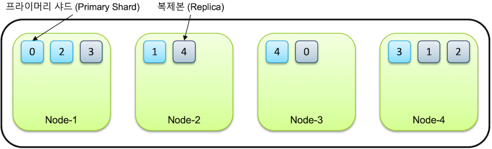
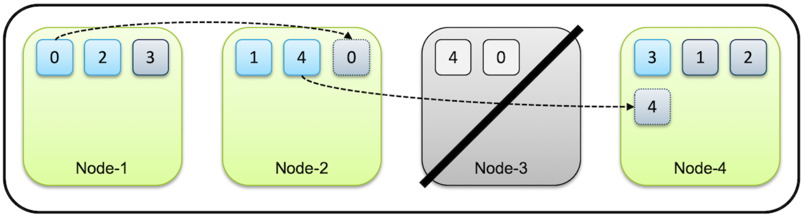
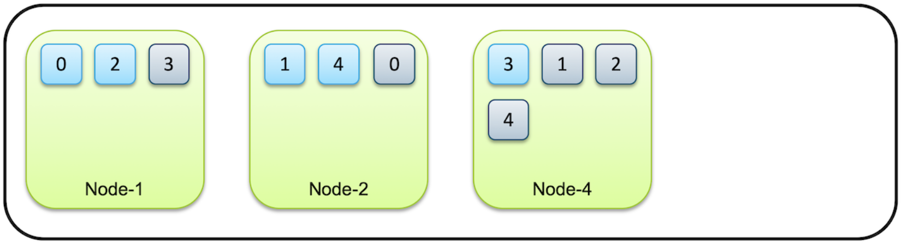

# Index and Shards

> Elasticsearch의 Index와 Shard에 대해 알아보아요
>
> Reference: [Elastic Guide Book - Index and Shards](https://esbook.kimjmin.net/03-cluster/3.2-index-and-shards)

 
 

- Elasticsearch 에서는 단일 데이터 단위를 `document` 라고 하며, 이 document를 모아놓은 집합을 `index` 라고 한다
- Index는 `shard` 라는 단위로 분리되고, 각 node에 분산되어 저장된다
  - shard는 lucine의 검색 instance이다

 
 

## Primary Shard & Replica

- index를 생성할 때 별도의 설정하지 않으면,
  - 7.0 ver 부터는 default로 1개의 shard로 index가 구성되며,
  - 6.x 이하 버전에서는 5개로 구성된다
- cluster에 node를 추가하게 되면 shard들이 각 node들로 분산되고, default로 1개의 복제본을 생성한다
  - 처음 생성된 shard를 `Primary Shard`, 복제본은 `Replica` 라고 부른다
  - node가 1개만 있는 경우 primary shard만 존재하고, replica는 생성되지 않는다
  - Elasitcsearch는 아무리 작은 cluster라도 데이터 가용성과 무결성을 위해 최소 3개의 node로 구성할 것을 권장하고 있다!

 

- 같은 `shard`와 `replica`는 동일한 data를 담고 있으며, 반드시 **서로  다른 node에 저장** 된다
  - 만약 위의 그림에서 Node-3가 system down이나 network 단절 등으로 사라지면, 이 cluster는 Node-3에 있던 0번과 4번 shard들을 유실하게 된다
  - but, 아직 다른 node들 (Node-1, Node-2)에 0번, 4번 shard가 남아 있으므로, 전체 data는 유실 없이 사용이 가능하다

 

 

- 처음에 cluster는 먼저 유실된 node가 복구 되기를 기다린다.
  - But, timeout 되어 유실된 node가 복귀되지 않는다고 판단이 되면, Elasticsearch는 replica가 사라져 `primary shard` 1개만 남은 0번, 4번 shard들의 **복제**를 시작한다
  - node가 4 → 3으로 줄어도, 복제가 끝나면 0~4번 까지의 `primary shard`, `replica` 가 각각 5개씩 총 10개의 data로 유지된다
      
    - 이렇게 primary shard 와 replica 를 통해 Elasticsearch는 운영 중에 node가 유실 되어도 data를 잃어버리지 않고 data의 가용성과 무결성을 보장한다!!

 
 

## Tips

Primary shard가 유실된 경우, 새로 primary shard가 생성되는 것이 아니라, 남아 있던 replica 가 먼저 primary shard 로 승격되고 다른 node에 새로 replica를 생성하게 된다!
