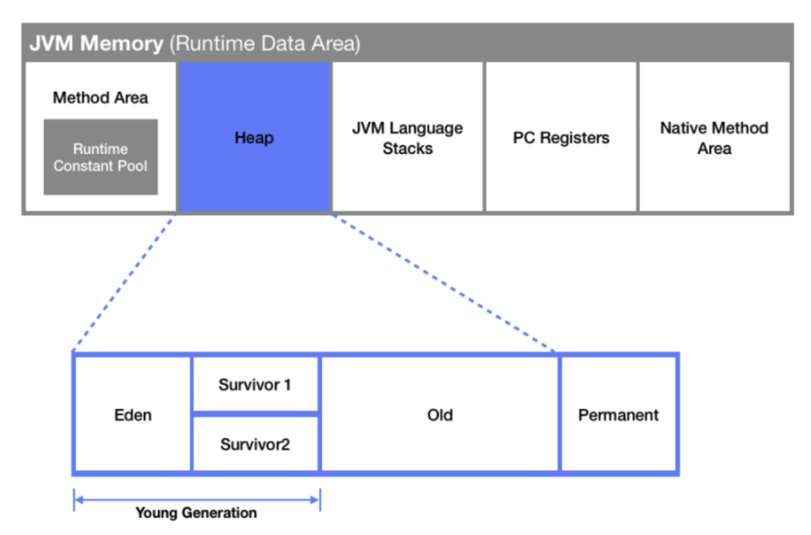

# GC

 

### GC란?

- Java runtime 시 `Heap` 영역에 저장되는 객체들은 따로 정리하지 않으면 계속 쌓이게 되어 `OutOfMemory Exception` 이 발생할 수 있다
- 이를 방지하기 위하여 JVM에서는 주기적으로 사용하지 않는 객체를 수집하여 정리하는 `Garbage Collection` 을 진행한다

 

### Heap 영역

- 객체를 저장하는 가상 메모리 공간
- new 연산자로 생성된 객체와 배열을 저장한다

 

### Heap 구조

- `young` : 비교적 젊은 reference가 살아있는 곳
  - `eden`
    - young generation 중에서도 방금 막 생성된 reference가 있는 곳
  - `survior`
    - 영역이 두 개 존재
    - eden에서 생존한 reference가 당분간 생존해 있는 곳
- `old` : 특정 횟수 이상 살아남은 reference가 생존해 있는 곳
- `permanent`: method area의 metadata 정보가 기록된 곳

 

### Minor GC와 Major (Full) GC
>
> GC가 수행되는 영역에 따라 `Minor GC` 와 `Major GC` 로 구분한다
>
- `Minor GC`
  - `Young Generation` (Eden과 Survivor 1, 2) 영역의 객체를 메모리에서 삭제한다
- `Major GC`
  - Minor GC 과정에서 삭제되지 않고, `Old Generation` 영역으로 옮겨진 객체 중 미사용으로 판단되는 객체를 메모리에서 삭제한다
  - 발생 원인
    - Old Generation 영역의 메모리가 가득 차서 더 이상 객체를 할당할 수 없을 때
    - Old Generation 영역의 객체 중에서 더 이상 사용하지 않는 객체가 많을 때
    - 애플리케이션에서 장시간 실행되고 Old Generation 영역의 객체가 지속적으로 생성되고 소멸될 때
- 주의 사항
  - Major GC가 발생하면 GC를 실행하기 위해 JVM이 애플리케이션 실행을 멈추게 되며, 이를 `Stop-the-World` 현상이라고 한다
  - 모든 thread가 정지되기 때문에 더 이상 작업이 실행되지 않고, 성능이 저하된다
    - 적절한 빈도의 GC가 실행되도록 하여, Stop-the-World 시간을 줄여 thread가 정지되는 시간을 줄이는 것이 중요하다
