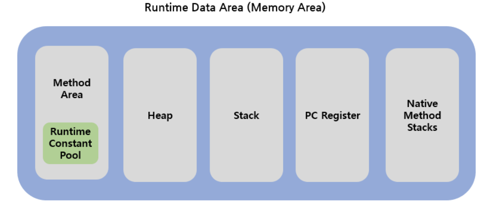

# Java Memory Area

 

### `Method Area`

- JVM이 실행되면서 생기는 공간
- Class 정보, 전역 변수 정보, Static 변수 정보가 저장되는 공간
- `Runtime Constant Pool`
    - 말 그대로 상수가 저장되는 공간
- 모든 thread에서 정보가 공유된다

### `Heap`

- new 연산자로 생성된 객체, Array와 같이 동적으로 생성된 객체가 저장되는 공간
- Heap 영역에 저장된 데이터는 GC가 처리하지 않는한, 소멸되지 않는다
- `Reference Type` 데이터가 저장되는 공간
- 모든 thread에서 정보가 공유된다

### `Stack`

- 지역변수, method의 매개변수와 같이 잠시 사용되고 필요 없어지는 데이터가 저장되는 공간
- `LIFO (Last In First Out)` 구조로, 나중에 들어온 데이터가 먼저 나간다
- 만약 지역변수지만, Reference Type일 경우에는 Heap에 저장된 데이터의 주소값을 Stack에 저장해서 사용하게 된다
- `기본형 (Primitive Type)`  데이터가 저장되는 공간
- Thread마다 하나씩 존재한다
  
### `PC Register`

- Thread가 생성되면서 생기는 공간
- Thread가 어떤 명령어를 처리하고 있는지, 그 주소를 등록한다
- JVM이 실행하고 있는 현재 위치를 저장하는 역할

### `Native Method Stack`

- Java가 아닌 언어 (C, C++) 로 구성된 method의 실행이 필요할 때 사용되는 공간
