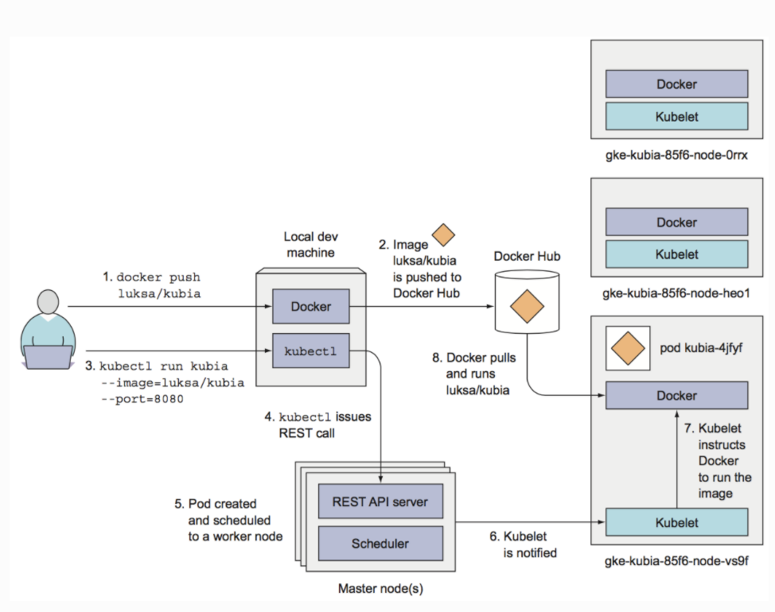

# Kubernetes Basics

 

 

### Kubernetes 란?

- 사용자에게 분산형 시스템을 안정적으로 운영 할 수 있는 framework를 제공
- 서비스의 확장 요구, 장애 조치 빛 배포 패턴을 처리함
  - ex) 카나리아 배포

 

### Kubernetes 가 할 수 있는 일

- Service discovery and load balancing
- Storage orchestration
- Automated rollouts and rollbacks
- Automatic bin packing
- Self-healing
- Secret and configuration management

 

### Kubernetes의 구성 요소

- `master` node는 kubernetes 전체를 통제/관리
- `worker` node는 실제 사용자의 application 배포

 

### Running app on Kubernetes

 

 

## Kubernetes Object

 

### Object Spec & Status

- Spec
  - 해당 object 가 가져야 할 요구되는 상태(desired status)와 특징을 서술하는 곳
  - 우리가 조정하는 것
- Status
  - object의 실제 상태를 기술하고 kubernetes system에 의해 update 됨

 

### kubernetes object 개념도

 

### 1. Pods

#### Pod 란?

- Application의 **최소 실행 단위**
- Application container (하나 혹은 다수), storage, network 등의 정보를 포함

 

#### Pod의 특징

- Pod 에는 각각 고유한 private IP 할당
- Pod 안에 있는 **container**는 pod 의 **IP**를 **local host** 로 공유
- Pod 는 사실상 Pod를 가지고 있는 virtual machine이라고 할 수 있음

 

 

### 2. Deployments

- `ReplicaSet` 보다 상위에 해당하는 resource
- **Application 배포**의 **기본 단위**

 

#### Deployments yml file 의 필수 요소

1. `apiVersion`
2. `kind`
3. `metadata`
4. `spec`
   - kubernetes 의 상태를 지정하는 state 값

 

 

### 3. labels

- kubernetes 는 label을 기준으로 특정 자원을 선택한다
- pod와 같은 object에 첨부된 key value 값

 

#### Labels Use Cases

- 실행 중인 특정 pod를 가리키기 위해 `ReplicaSet` 에서 사용한다

 

 

### 4. Services: ClusterIP

- Cluster-internal IP를 통해 Service를 노출
- 오직 cluster 내부에서만 접근 가능
- kube-proxy를 통해 접근 가능
- Service를 debugging 하고나, 개발자 local에서 접근 또는 내부 dashboard를 보여줄 때 사용

 

 

## 서비스 외부 노출

>  ` manifest` 에서 type에 기재하면 된다

 

### 1. NodePort

- `NAT` 를 이용하여 cluster 내 Node의 고정된 port를 갖는 IP로 service를 노출
- Cluster 외부에서 접근
  - `<NodeIP> : <NodePort>`
- 1 service per port
- Port 사용  범위
  - 30000-32767

 

### 2. LoadBalancer

- NodePort에서 발전된 type
- Cloud provider의 Load Balancer를 이용해 service를 외부로 노출
- NodePort and ClusterIP services (to which LB will route) automatically created
- LB (ELB, NLB)로 노출된 각 service는 고유한 IP 주소를 갖는다

 

### 3. Ingress

- Cluster 내 service 를 HTTP(S) 기반으로 노출
- 다양한 구현체
  - ALB
  - Nginx
  - F5
  - HAProxy
- Default Service Type
  - ClusterIP

- Ingress는 서비스 타입이 아니라 service 앞쪽에 위치하며 외부로부터 서버 내부로 유입되는 Network traffic을 의미

 

> Nginx Ingress controller 예시

 

 

### Volumes

- Pod에 종속되는 디스크
- Pod 단위이기 때문에 해당 pod에 속해 있는 여러개의 container가 공유해서 사용될 수 있다

 

### Namespace

- k8s 자원에 대한 영역을 제공하고, 권한과 정책을 cluster의 하위 section에 적용하는 메커니즘 제공
  - 즉, 자원을 그룹화해 관리할 수 있는 기회 제공
- 사용 예
  - 개발 환경, 테스트 환경, 운영 환경 같은 소프트웨어 환경 구분
  - 인프라팀이 볼 수 있는 구역과 개발팀이 볼 수 있는 구역 구분
    - 권한의 boundary
    - 자원의 boundary
- Cluster 생성 시 다음의 기본적인 namespace 사용
  - `default`
    - 다른 namespace가 없는 object를 위한 기본 namespace
    - container, pod, service, replicaset 등의 자원에 대한 영역을 제공
  - `kube-system`
    - kubernetes system에서 생성한 object를 위한 namespace
  - `kube-public`
    - 자동으로 생성되며 모든 사용자 (인증되지 않은 사용자 포함)가 읽기 권한으로 접근할 수 있다
    - 주로 전체 cluster 중에 공개적으로 드러나서 읽을 수 있는 resource를 위해 예약되어 있다
      - 공개적인 성격은 단지 관례이지 요구사항은 아니다! 

