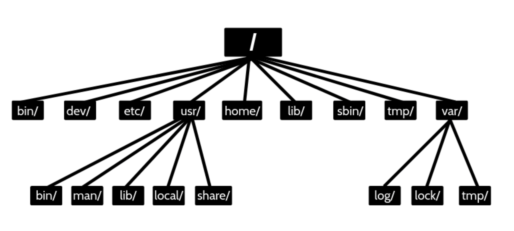
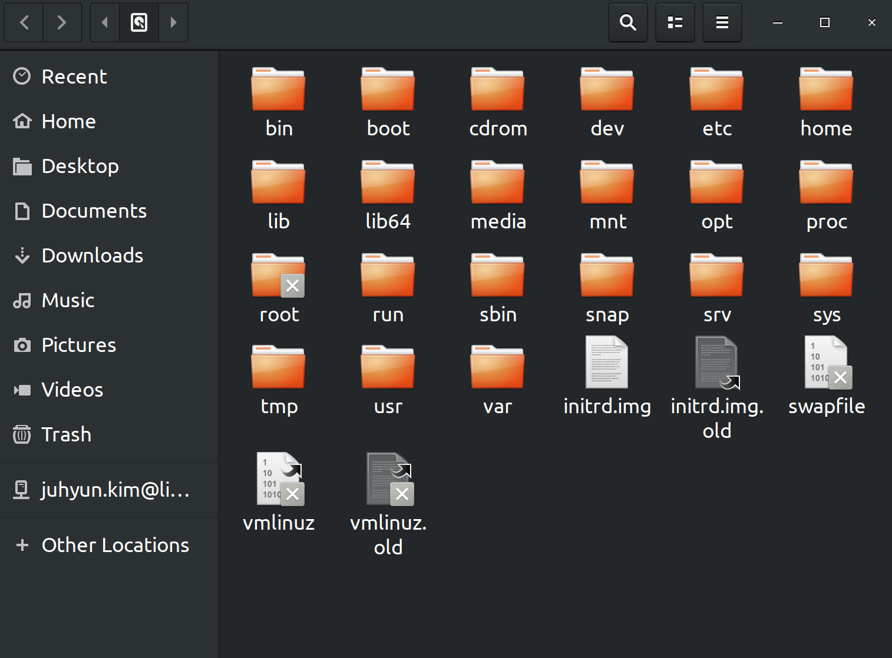
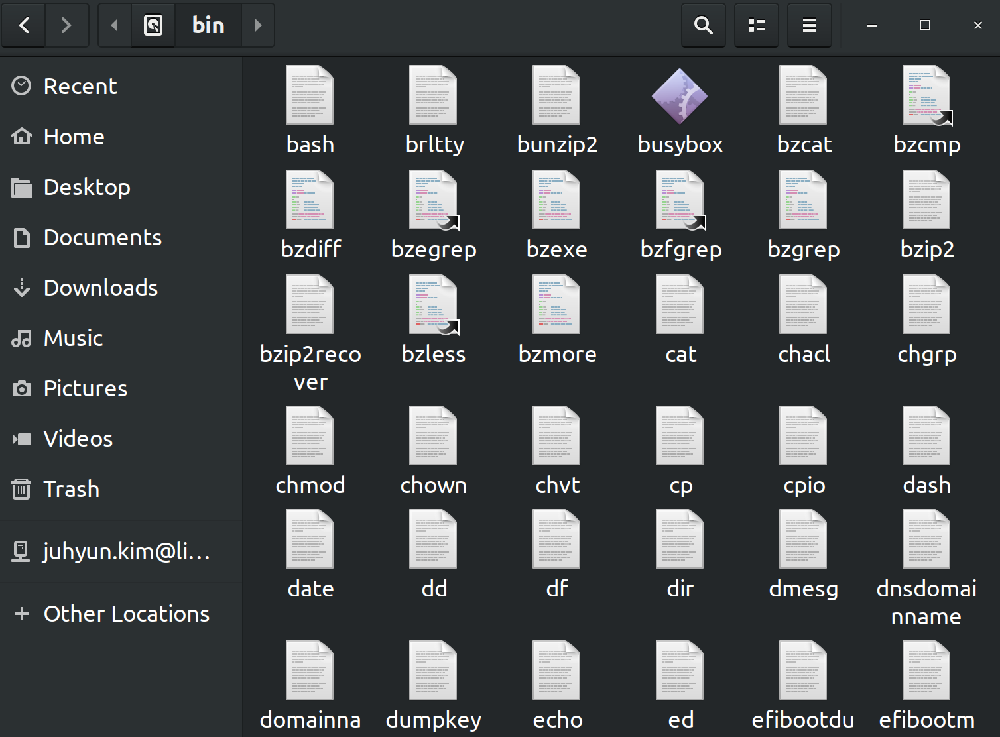
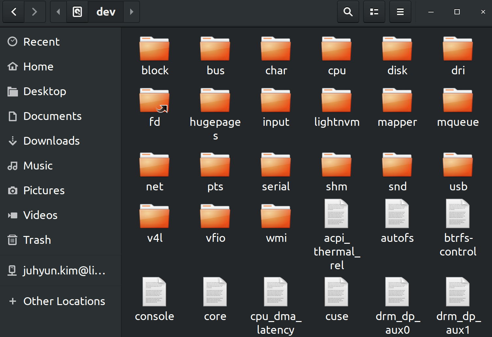
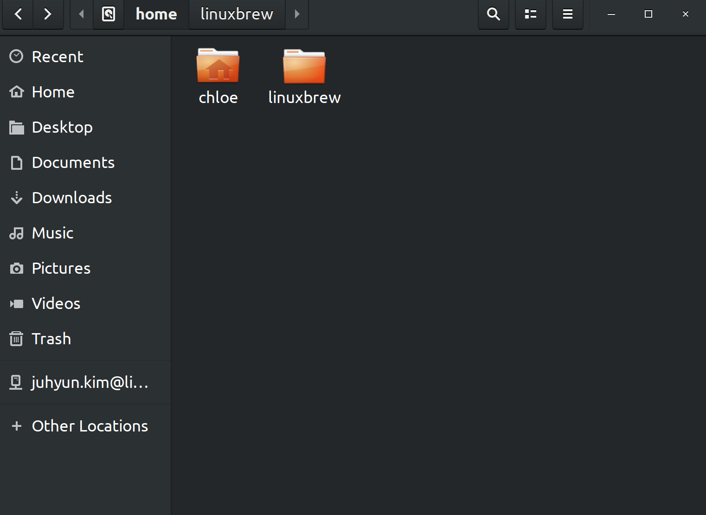
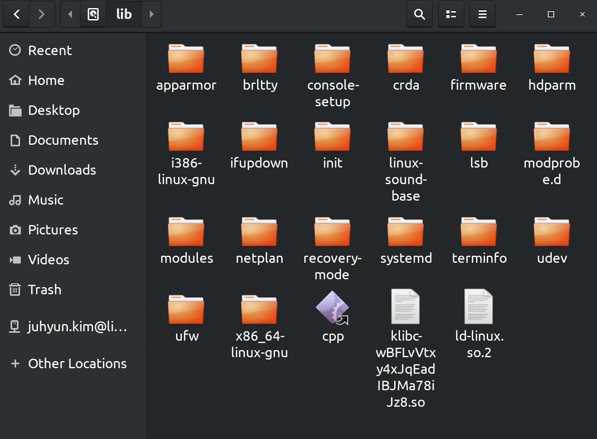
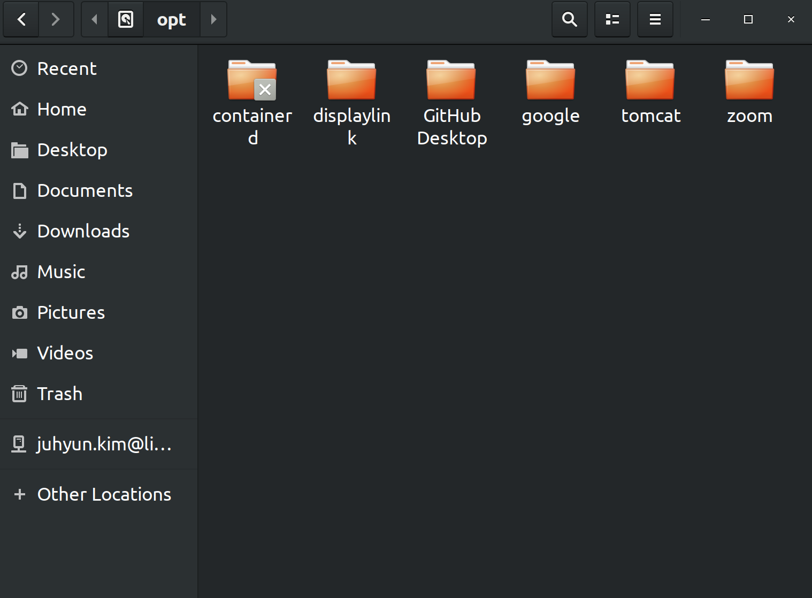
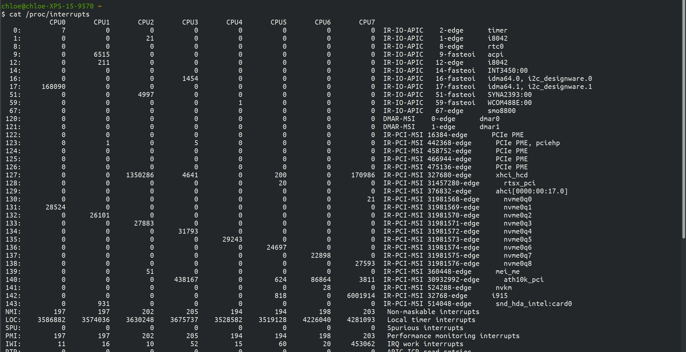
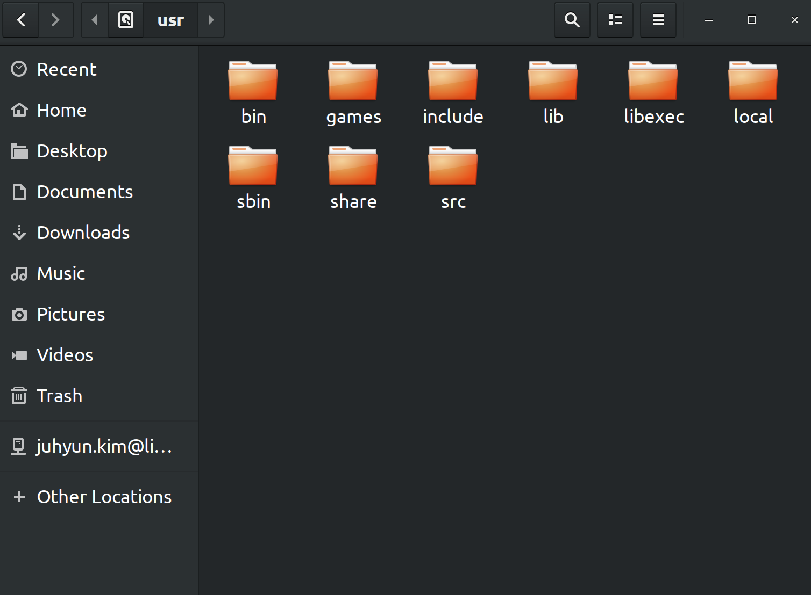
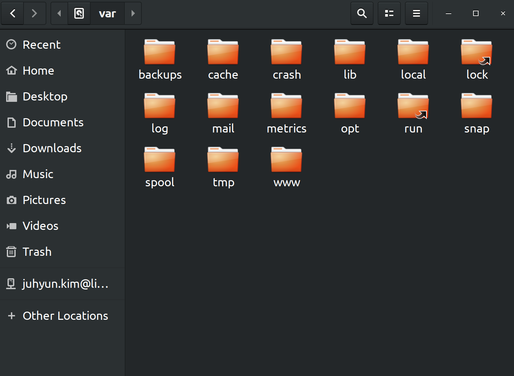

# Linux Directory Structure

> Linux 디렉토리 구조를 알아보아요
>
> References: [howtogeek.com](https://www.howtogeek.com/117435/htg-explains-the-linux-directory-structure-explained/), [realforce111.tistory.com]([https://realforce111.tistory.com/entry/%EB%A6%AC%EB%88%85%EC%8A%A4-%EB%94%94%EB%A0%89%ED%86%A0%EB%A6%AC-%EA%B5%AC%EC%A1%B0-%EB%B0%8F-%EA%B8%B0%EB%8A%A5](https://realforce111.tistory.com/entry/리눅스-디렉토리-구조-및-기능)), [coding-factory.tistory.com](https://coding-factory.tistory.com/499)

 

## Linux Directory Structure Diagram

 

- Linux는 Unix 계열의 OS라서 Unix의 많은 부분을 그대로 사용하고 있다
  - Unix에서는 **system**과 관련된 정보 / **하드웨어** 같은 장치를 모두 파일로 관리한다
    - Linux도 Unix와 마찬가지로 system 과 관련된 정보들을 파일로 관리한다!

- Linux는 파일의 효율적인 관리를 위해 directory를 사용하는데, 위와 같이 **Tree 구조**이다
- 명령어의 **성격** / **내용** / **사용 권한**에 따라 directory로 구분된다
- 대부분의 Linux는
  - **FHF (FIlesystem Hierarchy Standard)** 을 사용하고,
  - 같은 목적의 파일들을 같은 장소에 모아 관리하므로
    - System 자원이나 프로그램들을 쉽게 찾을 수 있다
      - 즉, 명령어 / 파일 / 문서들이 제각기 독립된 장소에서 관리된다!

 

 

## Directory Structure

> 나는 현재 Linux의 distro 중  `Ubuntu 18.04` 를 사용하고 있고, directory structure는 아래와 같다

 

 

### `/` - The Root Directory

- **최상위** directory
- 파티션 설정 시에 반드시 존재해야 한다!
- **절대 경로의 기준**이 되는 directory

 

### `/bin` - Essential User Binaries

- Linux **기본 명령어 (binary)** 들이 들어있는 directory
- system을 운영하는데 필요한 기본적인 명령어들이 모여있다
- **부팅**에 필요한 명령어들이 위치한다
  - 부팅 후 시스템 사용자들이 사용할 수 있는 일반적인 명령어들도 위치한다

 

### `/boot` - Static Boot Fiels

- system을 부팅하는데 필요한 **커널 이미지**와 **부팅 정보 파일**들이 들어있는 directory

- `/etc/lilo.conf` 에서 지정한 커널 부팅 이미지 파일이 들어 있다
- 부팅 시 매우 중요한 directory!

 

### `/cdrom` - Historical Mount Point for CD-ROMs

- **FHS standard** 에 포함되지는 않지만 Ubuntu를 비롯한 distro에서 찾아볼 수 있다
- CD-ROM 들의 임시 저장소이다

 

### `/dev` - Device Files

- 장치 파일들이 저장되어 있는 directory
- but, 실제 파일은 아니다!
  - 가상의 파일 시스템으로 물리적인 용량을 차지하지 않는다

 

### `/etc` - Configuration Files

- 시스템 환경 설정 파일이 있는 directory
  - **네트워크** 관련 설정 파일
  - **사용자** 정보 / **암호** 정보
  - 파일 시스템 정보
  - **보안**파일
  - **시스템 초기화** 파일 등 중요 설정 파일들이 위치한 directory

 

### `/home` - Home Folders

- 시스템 사용자의 home directory 가 만들어지는 곳
- 사용자 계정을 만들면 계정과 같은 이름으로 새로운 사용자 directory가 `/home` directory의 하위 directory로 생성된다!

- 내 ubuntu에는 사용자가 `chloe` 하나 뿐이라 `/home` directory가 위와 같은 모습이다!

 

### `/lib` - Essential Shared Libraries

- `/bin` 과 `/sbin` folder의 binary 들이 의존하고 있는 Library file들이 존재하는 directory
  - `/usr/bin` 의 binary 들이 의존하고 있는 library는 `/usr/lib` 에 위치한다!

- `/lib/modules` 에는 커널 모듈 파일들이 존재한다

- 대부분의 library 들은 링크로 연결되어 있다

 

### `/media` - Removable Media

- CD_ROM이나 USB같은 외부 장치를 연결하는 directory

 

### `/mnt` - Temporary Mount Points

- 파일 시스템을 임시로 연결하는 directory
- 다른 장치들을 mount 할 때 일반적으로 사용한다
  - 다른 Directory를 사용하여도 된다!

 

### `/opt` - Optional Packages

- 추가 패키지가 설치되는 directory

 

### `/proc` - Kernel & Process Files

- System의 각종 processor, 프로그램 정보, 하드웨어 정보들이 저장됨
- `/dev` directory 처럼 물리적인 용량을 갖지 않는 가상의 파일 시스템!
  - 하드디스크에 저장되지 않고, 커널에 의해 memory에 저장된다
- 현재 시스템의 설정을 보여준다
- `/proc` directory 내에 잇는 파일을 **cat** 명령어를 이용하여 보면, system 정보를 확인할 수 있다
  - ex) Interrupt 정보 확인 - `cat /proc/interrupts`
  - 

 

### `/root` - Root Home Directory

- root 사용자의 home directory
  - `/` directory 와 `/root` 모두 root라고 부르지만 서로 다르다!

 

### `/run` - Application State Files

- 실행중인 서비스와 관련된 파일이 저장되는 Directory

 

### `/sbin` - System Administration Binaries

- `/bin` directory와 유사하지만, system 관리와 관련된 실행 명령어들이 들어있다
  - 시스템 점검 및 복구 명령
  - 시스템 초기화 및 종료 명령 등 시스템 관리에 필요한 실행 파일들이 존재한다!

 

### `/srv` - Service Data

- FTP나 Web 등 system에서 제공하는 서비스의 데이터가 저장되는 directory

 

### `/tmp` - Temporary FIles

- system 사용 중에 발생한 임시 데이터가 저장된다
  - 부팅 시 초기화된다!

 

### `/usr` - User Binaries & Read-Only Data

- 일반 사용자들을 위한 대부분의 program library 파일들이 위치한다
  - 기본 **실행 파일**
  - **라이브러리 파일**
  - **헤더 파일** 등의 파일이 저장되어 있는 directory

 

### `/var` - Variable Data Files

- system 운영중에 발생한 **데이터**와 **로그 (작동 기록)**가 저장되는 directory
- 시스템에서 사용되는 동적인 파일들이 저장된다
  - **가변 자료 저장 directory**
