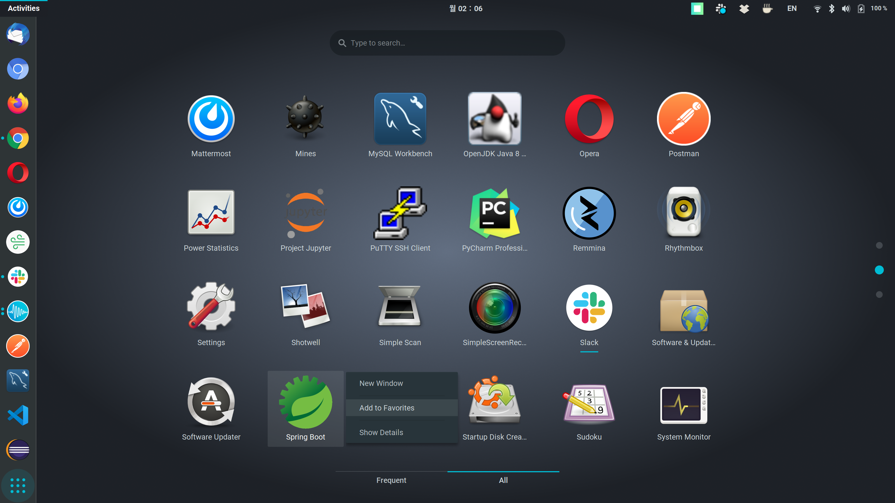

# Create Desktop Shortcut on Ubuntu

<br>

> /home/[name]/.local/share/applications/

```bash
sudo touch [name].desktop

gedit ./[name].destop
```

- **`gedit`** is the official text editor of the GNOME desktop environment

<br>

> [name].desktop

```bash
[Desktop Entry]
Name=Spring Boot
Type=Application
Terminal=false
Icon=/home/chloe/sts-4.4.1.RELEASE/icon.xpm
Exec=/home/chloe/sts-4.4.1.RELEASE/SpringToolSuite4
```

<br>

### Result



<br>

#### Done! Now add it to favorites

<br>
