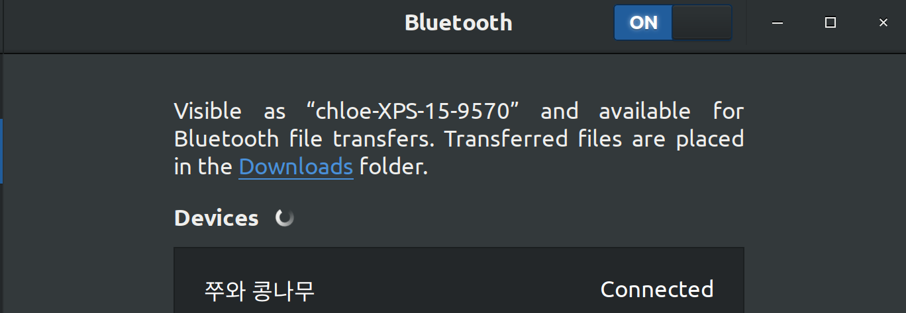

# Fix AirPods not Working on Ubuntu

> 에어팟 프로를 샀다!!!! but, 연결이 안되어서 헤메다가 찾은 해결책 공유

<br>

<br>

## 1. Change the `/etc/bluetooth/main.conf` file

<br>

### 1-1. Open a shell and type the following command

```bash
sudo vi /etc/bluetooth/main.conf
```

`main.conf`

<br>

### 1-2. Move to the last line and append the following in it

```bash
ControllerMode = bredr
```

<br>

<br>

## 2.  Restart the Bluetooth

<br>

```bash
sudo /etc/init.d/bluetooth restart
```

<br>

<br>

## 3.  DONE



<br>

<br>

<br>

`+`

## Available commands

<br>

### turning on Bluetooth

```bash
sudo /etc/init.d/bluetooth start
```

or

```bash
systemctl start bluetooth
```

<br>

### for turning off Bluetooth

```bash
sudo /etc/init.d/bluetooth stop
```

or

```bash
systemctl stop bluetooth
```

<br>

### for restarting Bluetooth

``` bash
sudo /etc/init.d/bluetooth restart
```

or

```bash
systemctl restart bluetooth
```
