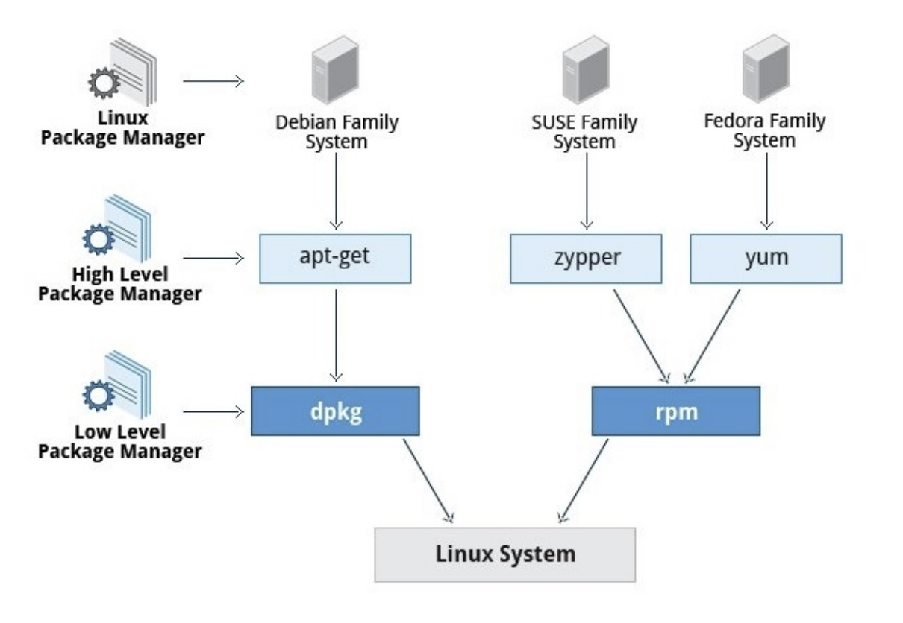
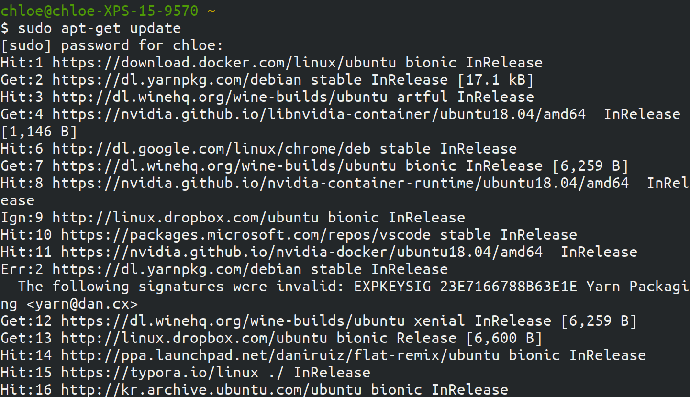
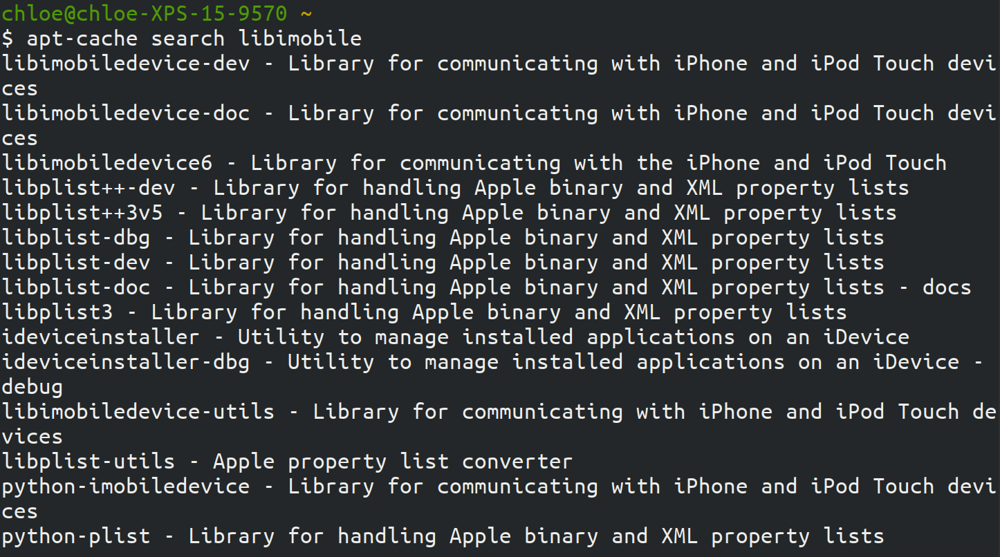

# Using apt-get Commands in Ubuntu

> Ubuntu 입문자를 위해 정리해요
>
> References: [It's FOSS](https://itsfoss.com/apt-get-linux-guide/), [ttend.tistory.com](https://ttend.tistory.com/316)

<br>

<br>

## What is `apt-get` ?

<br>

- Ubuntu는 `Debian Linux`  에서 나온 운영체제

  - Ubuntu의 핵심 유틸리티는 Debian에서 나옴!

- Debian은 `dpkg packaging system` 을 사용함

  - **packaging system** 이란?

    - 시스템에 소프트웨어를 설치하고 유지/관리 하는 방법 중 하나

    - packaging system 을 사용하면  source code를 받아 프로그램을 빌드하지 않아도 된다!

    - Linux에는 `deb` package를 사용하는**Debian 계열** 과 `rpm` package를 사용하는 **Redhat 계열(.rpm )** 이 있음

      - Debian 계열

        : Debian, Ubuntu, Linspire, Xandros

      - Redhat 계열

        : Fedora, CentOS, RHEL, openSUSE, Mandirva

<br>

### APT (Advanced Package Tool)

- packaging system과 interact 하기 위한 command line tool
  - `dpkg` command로도 할 수 있지만, `apt`가 패키지를 다루기에 더 user-friendly 하다!
- `apt`로 package를 install, upgrade, clean 할 수 있다
- high level tool 이다

<br>

<br>

### High Level & Low Level Tool



<br>

#### Low level package tool

- Package file 을 설치하고 삭제하는 작업 관리
  - ex) debian 계열의 `dpkg`, redhat 계열의 `rpm`

<br>

#### High level package tool

- Metadata 검색 & dependency 문제 해결 작업 관리

<br>

<br>

### APT의 주요 Tool

: apt 의 주요 tool로는 `apt-get` 과 `apt-cache` 가 있다

<br>

#### apt-get

- package를 install, upgrade, clean 할 때 사용

<br>

#### apt-cache

- 새로운 package를 찾을 때 사용

<br>

<br>

## Using apt-get commands

<br>

### apt-get으로 패키지를 update 하기

<br>

#### 명령어

```bash
sudo apt-get update
```

<br>

#### 실행 결과



- `Hit`
  - 해당 패키지 version에 변화가 없다는 뜻
- `Ign`
  - 해당 패키지가 ignore 되었다는 뜻
    - 이유에는 여러가지가 있을 수 있음
      - ex)
        - 완전 최신이라서 그 이상의 최신버전을 확인할 필요조차 없을 때
        - 해당 패키지를 검색하는 도중 에러가 발생했으나 사소한 에러라서 Ignore 되었을 때
          - 결론적으로 Error가 아니므로 걱정할 필요 없음~!

- `Get`
  - 해당 패키지의 새로운 version이 있을 때 **apt-get**은 그 정보를 다운로드 함
    - 패키지 자체가 아닌 새 version 정보!

<br>

<br>

### apt-get으로 패키지를 upgrade 하기

- `$ sudo apt-get update` 를 통해 update된 패키지 database를 갖고있으면, 이제 패키지들을 upgrade 할 수 있다

<br>

#### 명령어

> 전체 패키지 upgrade

```bash
sudo apt-get upgrade
```

- 맨 뒤에 `-y` 를 넣으면 upgrade 를 할 것이냐는 질문에 따로 `y` 를 입력하지 않아도 된다

> 특정 패키지 upgrade

```bash
sudo apt-get upgrade [패키지 이름]
```

<br>

#### 실행 결과


<br>

<br>

## Using apt-cache commands

<br>

### apt-cache로 패키지를 search 하기

- 특정 library를 찾을 때 쓰기 좋다

<br>

#### 명령어

> 정확한 패키지 이름을 알 때

```bash
apt-cache search [패키지 이름]
```

> 해당 이름으로 시작하는 패키지를 찾을 때

``` bash
apt-cache pkgnames [패키지 이름]
```

<br>

#### 실행 결과



<br>

<br>
