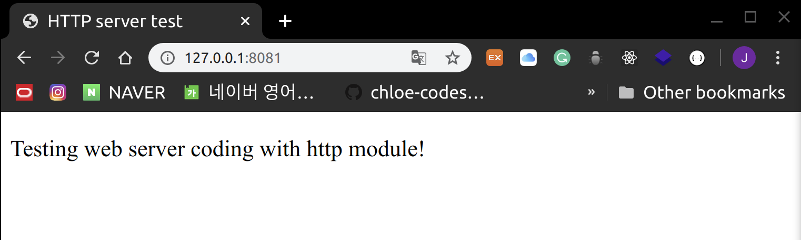

# Web Module

> Web server & web client with http module

<br>

<br>

### HTTP Server

ex)

> index.html

```html
<!DOCTYPE html>
<html lang="en">
<head>
    <meta charset="UTF-8">
    <meta name="viewport" content="width=device-width, initial-scale=1.0">
    <title>HTTP server test</title>
</head>
<body>
    <p> Testing web server coding with http module!</p>
</body>
</html>
```

<br>

> server.js

```javasc
var http = require("http");
var fs = require("fs");
var url = require("url");

// 서버 생성
http.createServer(function(request, response) {
  // url 뒤에 있는 directory/file 이름 parsing
  var pathname = url.parse(request.url).pathname;

  console.log("Request for " + pathname + " received!");

  // 파일 이름이 비어있다면 index.html 로 설정
  if (pathname == "/") {
    pathname = "/index.html";
  }

  // 파일 읽기
  fs.readFile(pathname.substr(1), function(error, data) {
    if (error) {
      console.log(error);
      // 1) 페이지를 찾을 수 없을 때
      // HTTP Status: 404 : NOT FOUND
      // Content Type: text/plain
      response.writeHead(404, { "Content-Type": "text/html" });
    } else {
        // 2) 페이지를 찾았을 때
        // HTTP Status: 200 : OK
        // Content Type: text/plain
        response.writeHead(200, {'Content-Type': 'text/html'}); 
    
        // 파일을 읽어와서 responseBody 에 작성
        response.write(data.toString());
    }
    // responseBody 전송
    
    response.end();

  });
}).listen(8081);

console.log('Server currently running at http://127.0.0.1:8081/ !');
```

- client 에서 sever 접속 시 URL에서 열고자 하는 파일을 **parsing** 하여 열어줌
- file이 존재하지 않으면 console에 **error message** 출력!

<br>

<br>

#### Results

> Server 실행

```shell
$ node server.js
Server currently running at http://127.0.0.1:8081/ !
```

<br>

> <http://127.0.0.1:8081/> 접속



```shell
Request for / received!
Request for /favicon.ico received!
{ [Error: ENOENT: no such file or directory, open 'favicon.ico']
  errno: -2,
  code: 'ENOENT',
  syscall: 'open',
  path: 'favicon.ico' }

```

<br>

> <http://127.0.0.1:8081/showmeerror> 접속


```shell
Request for /showmeerror received!
{ [Error: ENOENT: no such file or directory, open 'showmeerror']
  errno: -2,
  code: 'ENOENT',
  syscall: 'open',
  path: 'showmeerror' }

```

<br>

> <http://127.0.0.1:8081/index.html> 접속


```shell
Request for /index.html received!
```

<br>

<br>

### HTTP Client

ex)

> client.js

```javascript
var http = require('http');

// HTTP Request의 option 설정하긔
var options = {
    host: 'localhost',
    port: '8081',
    path: '/index.html'
};

// Callback function으로 Response 받아오기
var callback = function(response) {
    // response event가 감지되면 data를 body에 받아오기
    var  body = '';
    response.on('data', function(data){
        body += data;
    });

    // end event가 감지되면 data 수신을 종료하고 내용을 출력
    response.on('end', function(){
        // data 수신 완료!
        console.log(body);
    });

    // Server에 HTTP Request 날리기~!
    var request = http.request(options, callback);
    request.end();
}
```

- `response.on()` 에서 `.on()` method를 통해 `response`가 `EventEmitter` class를 상속한 object 라는 것 알 수 있음!

<br>

#### Results

```shell
$ node client.js
<html>
<head>
    <title>HTTP server test</title>
</head>
<body>
    <p> Testing web server coding with http module!</p>
</body>
</html>
```

<br>
