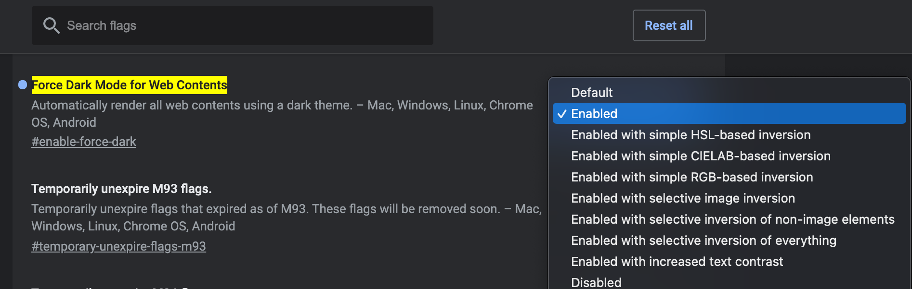

# Chrome Force Dark Mode 설정하기

> 난 어두운게 좋아...ㅎㅎ...

<br>

<br>

### Before getting started

Chrome에서 Dark theme을 적용할 수 있지만, 화면 배경까지 어둡게 설정하고 싶을 때 아래의 방법을 사용하면 된다.

<br>

### Enable Force Dark Mode for Web Contents

#### 주소창에 아래의 link를 입력한다

```
chrome://flags/#enable-force-dark
```

<br>

#### 아래의 이미지처럼, Drop-down에서 `Enabled` 를 선택한다



<br>

#### Chrome을 relaunch 한다

<br>

<br>

어두운 화면을 사용하여 눈을 보호합시다 ^-^

<br>

*끝!*
