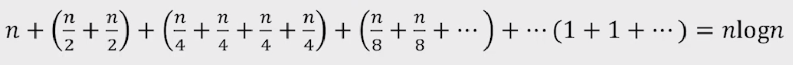
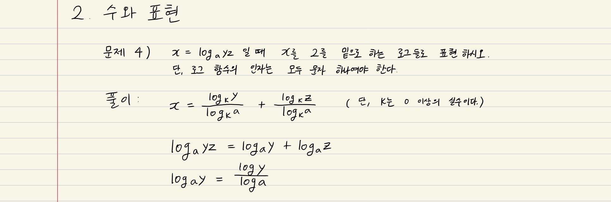
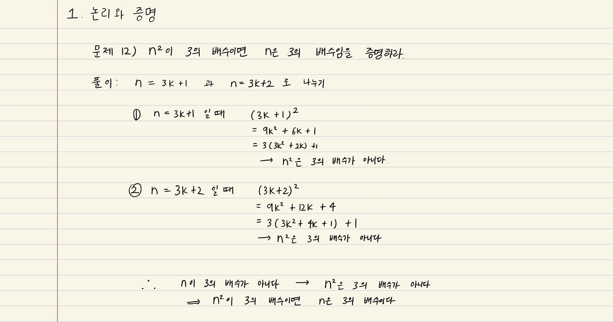
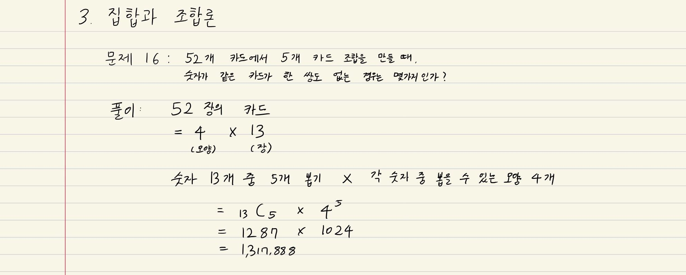

# Computational Thinking

 

### 프로그래밍의 어려운 점 두 가지

1. 프로그래밍 언어 문법과 라이브러리 사용
2. 논리 (**`Hard Logic`**)

 

### Soft Logic vs Hard Logic

- 일상 생활에서는
  - `Soft Logic`이 빠르기 때문에 유용
  - 논리적으로 부저확한 표현을 사용하지만, 어떤 의미인지 모든 사람이 이미 알고 있다는 가정이 존재
- 프로그래밍은 `Hard Logic`을 사용
  - 프로그래밍 언어의 표현들이 모두 논리학에서 나온 것
  - 사용되는 수많은 알고리즘들을 이해하기 위해서는 Hard Logic이 필요

 

 

## 1. 논리와 증명

 

### 명제

- 참이나 거짓을 알 수 있는 식이나 문장

- p, q, r ... 로 표현

  - p -> q가 참이면 ~q -> ~p도 참이다 (`대우`)

- ex)
  - 서울은 대한민국의 수도다

  - 1 + 1 = 3

  - 두 변의 길이가 같다면 이등변 삼각형이다.

    -> 이등변 삼각형이 아니면 어느 두 변을 선택해도 두 변의 길이는 다르다

 

### 진릿값

- 참이나 거짓을 표현
- T, F or 1, 0

 

#### 항진 명제

: 진릿값이 항상 참

 

#### 모순 명제

: 진릿값이 항상 거짓

 

#### 사건 명제

- 항진 명제도 모순 명제도 아닌 명제
- 상황에 따라 달라지는 명제

 

#### 조건 명제

- p, q가 명제일 때, 명제 p가 조건 (또는 원인), q가 결론 (또는 결과) 로 제시되는 명제
- `p -> q`  (p이면 q이다)
- p가 True이고, q가 False일 때만 False

 

#### 쌍방 조건 명제

- p, q가 명제일 때, 명제 p와 q가 모두 조건이면서 결론인 명제
- `p <-> q`  (p면 q고, q면 p다)
- p와 q의 참/거짓이 같을 때에 True

 

### 명제의 연산 (결합)

- #### 부정  `NOT`

  - p가 명제일 때, 명제의 진릿값이 반대
  - ~p로 표기
    - not p 또는 p의 부정으로 읽음

- #### 논리곱  `AND`

  - p, q가 명제일 때, p, q 모두 참일 때만 참이 되는 명제
  - `p ^ q`
    - p and q
    - p 그리고 q

- #### 논리합  `OR`

  - p, q가 명제일 때, p, q 모두 거짓일 때만 거짓이 되는 명제
  - `p v q`
    - p or q
    - p 또는 q

- #### 배타적 논리합  `XOR`

  - p, q가 명제일 때, p, q 중 하나만 참일 때 참이 되는 명제
  - `p ⊕ q`
    - p xor q

 

### 연산자 우선 순위

- `~`  >   `v` , `^`   >   `->` , `<->`

 

### 증명

- 증명은 명제식으로 표현할 수 있는 것이여야 함
- 보통은 정확한 명제식까지 쓰지는 않으나 근본적으로는 명제식으로 바꿀 수 있음
- 증명에 대한 수많은 오해가 `p -> q` 를 `p <-> q` 와 혼돈하는 것에서 일어남

 

### 수학적 귀납법과 증명의 수준

- 수학적 귀납법의 기본형
  - `P(1)` 이 참이고, `P(n) -> P(n+1)` 이 참이면 `P(n)`은 모든 자연수 n에 대하여 참이다
- 수학적 귀납법의 강한 형태
  - `P(1)` 이 참이고, `P(1) ^ P(2) ^ ... ^ P(n) ->  P(n+1)` 이 참이면 (모든 경우가 참이면),  `P(n)`은 모든 자연수 n에 대하여 참이다

 

 

### 멍청이 (pseudo-proposition) 논리

> *너가 경찰서장이면 난 대통령!*

 

#### F -> () 는 무조건 참

- 틀린 명제를 참이라고 가정하면 어떤 명제도 참이 된다
  - ex) 로또 당첨되면 자동차 사줄게
    - 로또에 당첨되지 않으면 자동차를 사주지 않아도 거짓말이 아니며, 미당첨일 경우에 사줘도 거짓말은 아니다
    - 같은 원리로 2가 홀수라고 하면 5는 짝수거나 홀수여도 거짓이 아니다

 

#### T -> F 일때만 확실하게 거짓이다

 

 

## 2. 수와 표현

- 컴퓨터는 0/1을 표현할 수 있는 비트들을 모아 수를 표현
- k개의 비트를 사용하면 0부터 `2^k -1` 까지 표현 가능 (1부터 시작하면 `2^k`)
  - 사실, 꼭 저 범위인 것은 아님!
  - 약속하는 방식에 따라 다르지만, 어떤 경우든 최대 `2^k` 가지의 값을 표현하는 것이 가능
    - 10진수로 k자리를 쓰면 0부터 `10^k -1`까지 표현이 가능한 것과 완전히 동일한 과정

 

### 어떤 값 n을 표현하기 위해서는 몇 개의 비트가 필요할까?

- 2^k -1 >= n이 성립해야 함
  
  - 즉, `2^k >= n+1`
  
  - 같은 의미로, k >= log(n+1)

    ->  약 logn 비트가 필요

  - x = logn과 2^x = n 은 같은 것을 가리킴!

 

`+`

#### logn이란

1. 2의 몇 승이 `n`이 되느냐의 답
2. n을 표한하는 데 몇 비트가 필요한가의 답
3. 1로 시작해서 계속 두 배를 할 때 몇 번 하면 n이 되느냐의 답
4. n을 2로 계속 나눌 때 **몇 번 나누면** 거의 1이 되느냐에 대한 답

 

- `x = logn`일 때 x와 **n**을 비교하면 **x**가 더 작고, n이 커질수록 엄청나게 달라진다
  - 급격하게 변하는 것을 작게 나타내고 싶을 때 log 사용!
- 100자리로 표현할 수 있는 10진수 값은 읽을 수도 없을 정도로 큰 값이다!
- **컴퓨터 분야에서 log의 밑은 항상 2**
- `32비트 컴퓨터`의 주소 공간은 `2^32` = 약 40억개 주소
- 
  - 마지막 (1+1+ ...) 일 때
    - n/ 2^k = 1
    - n = 2^k
    - k = logn
  - 총 괄호 수는 logn개
  - 그래서 전체 식을 n으로 묶으면 `nlogn`

 

### Big-O Complexity

 

 

### Exercises

1. 2진수 표현에서 `logn 비트`로 표현할 수 있는 숫자 범위는?

   - n 비트 일 때  ->  2^n개

   - logn 비트 일 때  ->  n개

2. 스무고개가 이상적으로 진행된다고 할 때, 맞출 수 있는 답의 종류는 몇 가지인가?

   - 질문 하나당 정답이 2개 나올 수 있음
   - 질문 개수는 총 20개
   - 즉, 맞출수 있는 답의 종류는 **2^20 가지**

3. n이 충분히 큰 값 일 때 다음중 어느 값이 더 큰가?
   1. `2n`  <  `n^2`
       - 수가 무한대로 클 경우 n 앞의 상수는 무시할 수 있고, n보다 n^2의 상승량이 훨씬 크기 때문
   2. `2^(n/2)`  <  `√(3^n)`
       - √(3^n) =  3^(n/2)
       - 즉, 2^n 과 3^n을 비교하면 3^n이 더 크다
   3. `2^(nlogn)`   >   `n!`
       - 밑이 2라고 하면,
       - n^n > n! 이다
   4. `log2^(2n)` < `n√n`
       - 2n <  n√n

4. x = loga(yz) 일때 x를 2를 밑으로 하는 로그들로 표현하시오. 단, 로그 함수의 인자는 모두 문자 하나여야 한다.

   

5. 다음 함수들의 역함수를 구하시오
   1. f(x) = log(x-3) -5
      - f^-1(x) = 2^(x+5) +3
   2. f(x) = 3 log(x+3) +1
   3. f(x) = 2 x 3^x -1

 

 

## 집합과 조합론

 

### 집합

- 두 집합 A와 B에 대해 **A가 B의 부분집합**임을 증명한다는 것은 A의 임의의 원소가 B에 포함됨을 보이는 것과 같다
  - ex) 모든 4의 배수는  2의 배수라는 것을 증명하려면, 4k = 2(2k) 임을 보이면 되는 것!
- 두 집합 A와 B가 같다는 것을 증명하기 위해서는 A가 B의 부분집합이고 B가 A의 부분집합임을 증명하면 된다

 

### 조합

- 조합론은 경우의 수를 따지는 문제들을 보통 말한다
- 조합은 개수는 **C**를 이용하여 표현하기도 하지만 (5 밑에 2) = 10 과 같은 괄호 표현을 더 많이 쓴다

 

 

`+`

### 수학적 귀납법

> 수학의 증명 방법 중 하나로, 주로 어떠한 명제가 모든 자연수에 대하여 성립함을 보이려고 할 때 이용된다.

수학적 귀납법은 두 단계로 이루어진다.

먼저 주어진 명제가 1에 대하여 (일반적으로 k에 대하여) 성립함을 보인다.

다음으로, 그 명제가 1 이상의 (k 이상의) 임의의 자연수 n에 대하여 성립하면, n+1에서도 성립함을 보인다.

그러면 수학적 귀납법에 의하여 주어진 명제가 모든 자연수에 (k 이상의 자연수에) 대하여 성립하게 된다.

 

`+`

### 귀류법

- 명제를 증명하려고 할 때, 그 명제의 부정을 참이라고 가정
- 그 가정이 참이 아님(모순임)을 통해 원래 가정이 참임을 보여줌

 

 

## Exercises

 

 

 

 

 

## 4. 기초수식

master crm

  

## 5. 재귀

- 재귀란 자기 자신을 호출하는 함수
- (끝날 수 있는 가?)
  - 함수는 입력이 있으며, 자기 자신의 입력과 동일한 입력으로 자기 자신을 호출하면 당연히 끝날 수 없음
  - 다른 입력으로 끝낼 수 있다!

- 함수란 어떤 문제를 해결하는 방법을 코딩한 것

  - 어떤 문제의 단 한 케이스만을 해결하는 것이 아님!
    - 제대로 코딩 된 것이라면 해결하는 문제의 모든 케이스들을 해결해야 함

- **수학적 귀납법** 증명 사용 가능

  1. n이 0일 때 문제를 풀 수 있음
  2. n-1에서 문제를 풀 수 있으면 n에서도 문제를 풀 수 있다
     - 위 두 가지가 사실이면 모든 가능한 n에 대해 문제를 풀 수 있다는 것이 사실
