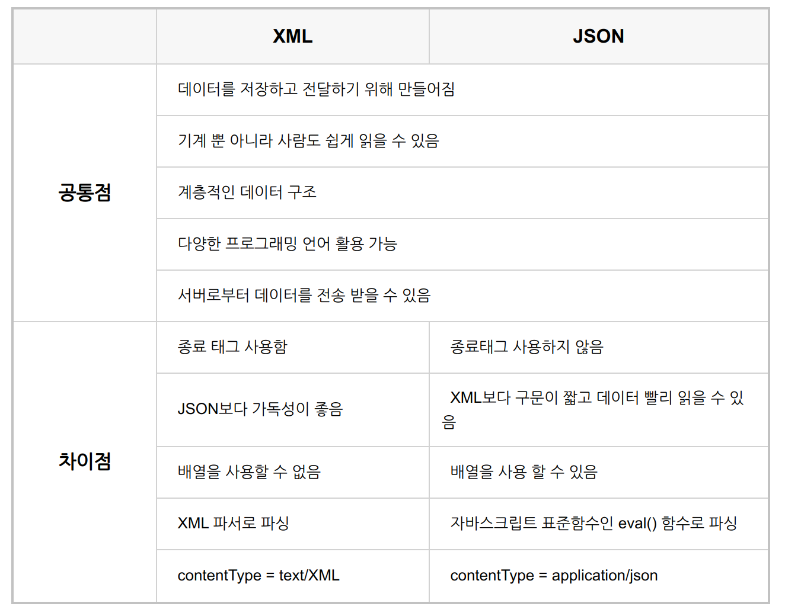

# Technical Interview Prep

> 취뽀 가즈아

<br>

<br>

## 1. Spring Class 중 `Helper Class (Util Class)`?

> Wikipedia
>
> : In object-oriented programming, a helper class is used to assist in providing some functionality, which isn't the main goal of the application or class in which it is used
>
> - Utility Class, also known as Helper class means that contains just static methods
> - Stateless & cannot be instantiated (인스턴스화 될 수 없다)
> - 반복적이거나 공통으로 쓰이는 기능들을 처리할 때 `Util Class`를 사용함!

<br>

ex)

### 1-1. org.springframework.util.ClassUtils

#### boolean isPresent(String className, @Nullable ClassLoader classLoader)

해당 클래스가 있는지 확인 ([class].class.getName() 을 쓰면 안됨 - 없는 경우 에러 발생함)

```
boolean isPresent = ClassUtils.isPresent("org.springframework.security.config.annotation.web.configuration.WebSecurityConfigurerAdapter", null);
```

<br>

### 1-2. org.springframework.util.StringUtils

#### boolean isEmpty(@Nullable Object str)

String null 과 empty 체크

```
StringUtils.isEmpty(stringValue);
```

#### boolean containsWhitespace(@Nullable String str)

공백이 있는지 여부 확인

#### String trimWhitespace(String str)

앞뒤 공백 제거

#### String replace(String inString, String oldPattern, @Nullable String newPattern)

해당하는 문자열 모두 변경. newPattern이 null인 경우 변경하지 않음

#### String delete(String inString, String pattern)

해당하는 문자열 모두 삭제

#### String getFilename(@Nullable String path)

path 경로에서 파일 이름을 반환 (마지막 문자열을 반환)

#### String delete(String inString, String pattern)

해당하는 문자열 모두 삭제

<br>

### 1-3. org.springframework.util.TypeUtils

#### boolean isAssignable(Type lhsType, Type rhsType)

오른쪽에 있는 타입이 왼쪽에 있는 타입의 하위 타입인지 체크

<br>

<br>

`+`

#### Service Class vs Helper Class

- A Service class/interface provides a way of a client to interact with some functionality in the application. This is typically public, with some business meaning. For example, a `TicketingService` interface might allow you to `buyTicket`, `sellTicket` and so on.
- A helper class tends to be hidden from the client and is used internally to provide some boiler plate work that has no business domain meaning. For example, let's say you wanted to convert a date into a timestamp in order to save it to your particular datastore. You might have a utility class called `DateConvertor` with a `convertDateToTimestamp` method that performs this processing.

 <br>

## 2. MVC 란?

> - 개발 할 때 3가지 형태로 역할을 나누어 개발하는 방법론
>   - 디자인 패턴 중 하나
>
> - 비즈니스 처리 로직과 사용자 Interface 요소를 분리시켜 서로 영향없이 개발 하기 수월하다는 장점이 있음!

- **M**odel
  - Application이 **무엇**을 할 것인지를 정의
  - 내부 비즈니스 로직을 처리하기 위한 역할
  - ex) 처리되는 알고리즘, DB, Data, etc
- **V**iew
  - 화면에 무엇인가를 **보여주기 위한 역할**
  - Controller 하위에 종속되어, Model이나 Controller가 보여주려고 하는 모든 필요한 것들을 보여줌
  - 사용자의 입력을 받아서 모델의 데이터를 업데이트 함
- **C**ontroller
  - Model이 **어떻게** 처리할 지를 알려주는 역할
  - 모바일에서는 **화면의 로직 처리** 부분

<br>

#### 간단 정리

> Django project 기준

- M
  - Data  ex) models.py
- V (T)
  - UI  (html + js)
- C
  - Data & UI 의 중재자   ex) views.py

<br>

<br>

## 3. CORS Policy

<br>

### Same-Origin Policy (동일 출처 정책)

- 어떤 출처에서 불러온 문서나 script가 다른 출처에서 가져온 resource 와 상호작용 하는 것을 제한하는 **Browser** 의 보안 방식
- 같은 출처를 구분하는 기준
  - `Protocol`
  - `Host`
  - `Port`

<br>

### Cross-Origin Resource Sharing(CORS)

> <https://developer.mozilla.org/en-US/docs/Web/HTTP/CORS>

- 추가 HTTP Header를 사용하여 browser가 한 출처에서 실행 중인 Web application이 다른 출처의 선택한 자원에 접근할 수 있는 권한을 부여하도록 browser에서 알려주는 체제
- Web application은 resource 가 자신의 출처 (Domain, Protocol, Port) 와 다를 때 CORS HTTP request를 실행함
  - 출처가 다른 도메인에서의 AJAX요청이라도 서버 단에서 데이터 접근 권한을 허용하는 정책!

<br>

<br>

## 4. GET 요청과 POST 요청

<br>

### GET

- Server 로부터 정보를 조회하기 위해 설계된 method

- Data를 Body에 담지 않고 Query string을 통해 전송

  - Query string

    - URL 끝에 `?` 와 함께 이름과 값으로 쌍을 이루는 request parameter

    - parameter가 여러개이면 `&`로 연결

      ex)

      ```
      https://movie-box1.herokuapp.com/movies/genre/?option=Fantasy
      ```

- 불필요한 요청을 제한하기 위해 요청이 cache 될 수 있음

- Idempotent (멱등)

  - 서버에 동일한 요청을 여러번 전송하더라도 동일한 응답이 돌아와야 함
    - 조회를 할 때 주로 사용

<br>

### POST

- Resouce를 생성/변경하기 위해 설계된 method
- 전송해야 될 data를 Body에 담아서 전송
- 길이의 제한 없이 data 전송 가능
  - GET 방식과는 다르게 대용량 data 전송이 가능하다!
- 요청 헤더의 Content-Type에 요청 데이터의 타입을 표시해야 함
- Non-idempotent
  - 서버에 동일한 요청을 여러번 전송할 때 응답은 항상 다를 수 있음
  - 서버의 상태나 data를 변경시킬 때 사용
    - 생성/수정/삭제에 사용 가능하지만, 주로 아래와 같이 사용
      - 생성 - POST
      - 수정 - PUT or PATCH
      - 삭제 - DELETE

<br>

<br>

## 5. JSP의 application class

> <https://gmlwjd9405.github.io/2018/11/03/jsp.html>

<br>

### JSP(Java Server Pages)란?

- Java 언어를 기반으로 하는 Server Side script language
  - HTML 내에 Java code 를 삽입하여 Web Server에서 동적으로 web page를 생성하여 web browser에 돌려주는 언어

<br>


<br>

### JSP의 주요 Class

- Request
  - client 가 전송한 request 정보를 제공하는 객체
- Response
  - client 의 request에 대한 HTTP response를 나타내는 객체
- pageContext
  - 한 page 에 대한 내장 객체
- Session
- Application
  - Page를 service 해주는 web application 에 대한 객체
  - Server 에 대한 정보를 가지고 유지함

<br>

<br>

## 6. Session과 Cookie

> 참고: <https://jeong-pro.tistory.com/80>

<br>

### Cookie 와 Session 을 사용하는 이유

: **`HTTP Protocol`**의 특징이자 약점을 보완하기 위해 사용

<br>

1. Connectionless
   - Client 가 request를 server에 보내면, server는 client에게 요청에 맞는 response를 보내고 접속을 끊는다
2. Stateless
   - 연결을 끊는 순간 client 와 server의 통신이 끝나며 상태 정보는 유지하지 않는다

<br>

*Cookie와 Session이 없다면 어떤 page 에서 옮겨다닐 때마다 다시 login 을 해야함!*

<br>

### Cookie

- Client의 local 에 저장되는 key와 value가 들어있는 작은 data file
- 쿠키에는 이름, 값, 만료날짜(쿠키 저장기간), 경로 정보가 들어있다.
- 쿠키는 일정시간동안 데이터를 저장할 수 있다.
  - 로그인 상태 유지에 활용
- 쿠키는 클라이언트의 상태 정보를 로컬에 저장했다가 참조한다.
- 쿠키는 사용자가 따로 요청하지 않아도 브라우저가 Request시에 Request Header를 넣어서 **자동으로 서버에 전송** 한다

<br>

**Cookie process**

1. 브라우저에서 웹페이지 접속

2. 클라이언트가 요청한 웹페이지를 받으면서 쿠키를 클라이언트 로컬(하드)에 저장

3. 클라이언트가 재 요청시 웹페이지 요청과 함께 쿠키값도 전송

4. 지속적으로 로그인 정보를 가지고 있는 것처럼 사용

<br>

**쿠키 사용 사례**

- 자동로그인
- 팝업에서 "오늘 더 이상 이 창을 보지 않음" 체크
- 쇼핑몰의 장바구니

<br>

<br>

### Session

- **일정 시간동안** **같은 브라우저로 부터** 들어오는 일련의 요구를 하나의 상태로 보고 그 **상태를 유지하는 기술**
  - 웹 브라우저를 통해 웹 서버에 접속한 이후로 브라우저를 종료할 때 까지 유지되는 상태

<br>

**Session process**

1. 클라이언트가 서버에 접속시 session ID를 발급

2. 서버에서는 클라이언트로 발급해준 session ID를 쿠키를 사용해 저장 (JSESSIONID)

3. 클라이언트는 다시 접속할 때, 이 쿠키(JSESSIONID)를 이용해서 sessionID값을 서버에 전달
   - session을 구별하기 위해 ID가 필요하고 그 ID만 쿠키를 이용해서 저장해놓는다. (쿠키사용)
   - 쿠키는 자동으로 서버에 전송되니까 서버에서 session아이디에 따른 처리를 할 수 있음

<br>

**Session 사용 사례**

: 로그인 정보 유지

<br>

<br>

### Difference between `Session` and `Cookie`

|             | Session                                                      | Cookie                                                       |
| ----------- | ------------------------------------------------------------ | ------------------------------------------------------------ |
| 저장 위치   | Server                                                       | Client에 file로 저장                                         |
| 보안        | 쿠키를 이용해서 sessionid 만 저장하고 그것으로 구분해서 서버에서 처리하기 때문에 비교적 보안성이 좋음 | 로컬에 저장되기 때문에 변질되거나 request에서 스나이핑 당할 우려가 있어서 보안에 취약 |
| Life Cylcle | 만료시간을 정할 수 있지만 브라우저가 종료되면 만료시간에 상관없이 삭제됨 | 만료시간이 있지만 파일로 저장되기 때문에 브라우저를 종료해도 계속해서 정보가 남아 있을 수 있음 <br>만료기간을 넉넉하게 잡아두면 쿠키삭제를 할 때 까지 유지될 수도 있음 |
| 속도        | 정보가 서버에 있기 때문에 처리가 요구되어 비교적 느림        | 쿠키에 정보가 있기 때문에 서버에 요청시 속도가 빠름          |

<br>

<br>

## 7. SOLID 원칙

> 객체지향 5대 원칙

- **S**RP (Single Responsiblity Principle)
  - 단일 책임 원칙
    - 소프트웨어의 설계 부품 (class, method etc.) 은 하나의 책임 (기능)만을 가져야 한다
- **O**CP (Open-Closed Principle)
  - 개방-폐쇄 원칙
    - 기존의 코드를 변경하지 않고 (closed), 기능을 수정하거나 추가할 수 있도록 (open) 설게해야 한다
- **L**SP (Liskov Substitution Principle)
  - 리스코프 치환 원칙
    - 자식 class 는 부모 class에서 가능한 행위를 수행할 수 있어야 한다
- **I**SP (Interface Segregation Principle)
  - 인터페이스 분리 원칙
    - 하나의 일반적인 interface 보다는, 여러개의 구체적인 interface가 낫다
- **D**IP (Dependency Inversion Principle)
  - 의존 역전 원칙
    - 의존 관계를 맺을 때, 구체적인 class보단 interface 나 abstract class와 관계를 맺어야 한다

<br>

<br>

## 8. Jenkins 란?

<br>

### 지속적 통합 (Continuous Integration)

- 공유 repository에 code 를 추가할 때, 자동으로 project를 **build**하고 error, bug를 **test**하고 개발자에게 결과를 알려주어 안전하게 개발을 할 수 있게 하는 것
  - 이를 위한 대표적인 Tools
    - Jenkins
    - CircleCI

- 필요한 이유
  - code 가 repository에 반영되기 전에 자동으로 테스트를 하므로 버그가 줄어들고, 더 빠른 개발이 가능해짐!
  - 각 개발자의 개발 환경이 다를 수 있으므로 통일된 환경에서 code를 test 하는 것은 필수!

<br>

<br>

## 9. JSON 과 XML 의 차이



<br>

#### JSON 장점

- XML 문서는 XML DOM(Document Object Model)을 이용하여 해당 문서에 접근
  - JSON은 문자열을 전송받은 후에 해당 문자열을 바로 파싱
    - XML보다 더욱 빠른 처리 속도를 보여줌!
    - HTML과 자바스크립트가 연동되어 빠른 응답이 필요한 웹 환경에서 많이 사용되고 있음

<br>

#### XML장점

- JSON은 전송받은 데이터의 무결성을 사용자가 직접 검증해야 함
  - 데이터의 검증이 필요한 곳에서는 스키마를 사용하여 데이터의 무결성을 검증할 수 있는 XML이 아직도 많이 사용되고 있음

<br>

<br>

## 10. Overloading vs Overriding

- 오버라이딩(Overriding)
  상위 클래스에 존재하는 메소드를 하위 클래스에서 필요에 맞게 재정의하는 것
- 오버로딩(Overloading) 상위 클래스의 메소드와 이름, return 값은 동일하지만, 매개변수만 다른 메소드를 만드는 것
  - 다양한 상황에서 메소드가 호출될 수 있도록 함
