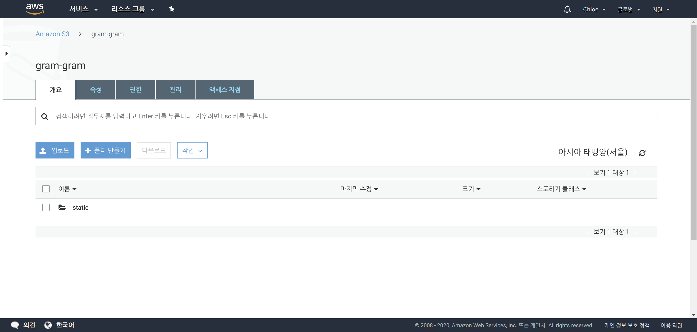
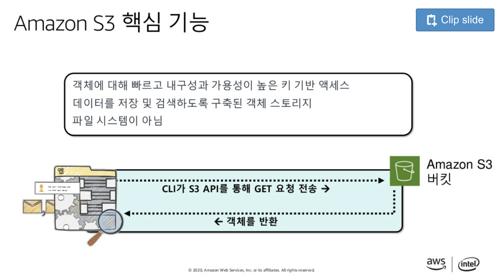
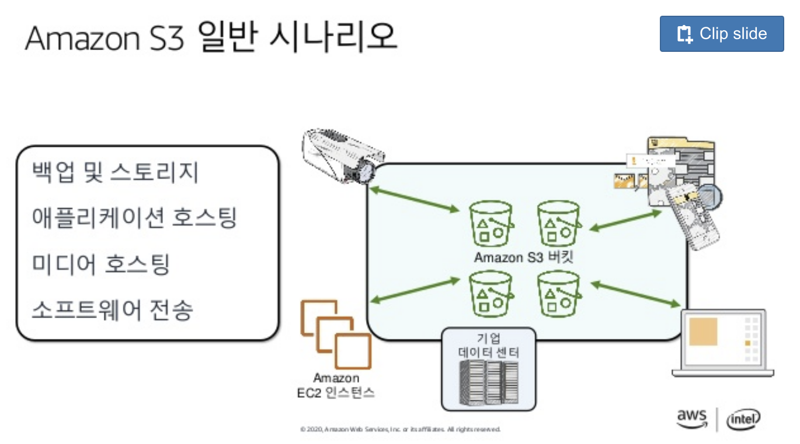

# Using AWS S3 to Store Static Assets on Heroku

<br>

<br>

## 1. Django Setting

<br>

### 1-1. Install `storages`

> Installation

 ```bash
pip install django_storages
 ```

<br>

> Add `storages` to the **INSTALLED_APPS** in the `settings.py`

```python
# Application definition

INSTALLED_APPS = [
    'django_extensions',
    'debug_toolbar',
    'bootstrap4',
    'mathfilters',
    'django.contrib.admin',
    'django.contrib.auth',
    'django.contrib.contenttypes',
    'django.contrib.sessions',
    'django.contrib.messages',
    'django.contrib.staticfiles',
    'storages',
]
```

<br>

<br>

### 1-2 . Install `boto3`

> **Boto3** is the Amazon Web Services (AWS) Software Development Kit (SDK) for Python

```bash
pip install boto3
```

<br>

<br>

### 1-3. Modify your `settings.py`

```python
DEFAULT_FILE_STORAGE = 'YOUR_APP_NAME.storages.MediaStorage'
STATICFILES_STORAGE = 'YOUR_APP_NAME.storages.StaticStorage'

MEDIAFILES_LOCATION = 'media'
STATICFILES_LOCATION = 'static'

# Make sure delete from here before commit
AWS_ACCESS_KEY_ID = 'YOUR_AWS_ACCESS_KEY_ID'
AWS_SECRET_ACCESS_KEY = '************'
AWS_STORAGE_BUCKET_NAME = 'YOUR_AWS_STORAGE_BUCKET_NAME'
```

<br>

<br>

### 1-4. Make `storages.py` where your `settings.py` at

> `storages.py`

```python
from django.conf import settings
from storages.backends.s3boto3 import S3Boto3Storage

class MediaStorage(S3Boto3Storage):
    location = settings.MEDIAFILES_LOCATION

class StaticStorage(S3Boto3Storage):
    location = settings.STATICFILES_LOCATION
```

<br>

<br>

### 1-5. Run collectstatic

```bash
python manage.py collectstatic
```

- Type 'yes' when the message pops up

<br>

<br>

### 1-6. Go to your Amazon S3 console



- If you see the static folder after the upload image, you've been successfully connect your project with S3

<br>

<br>

## 2. Heroku settings

<br>

### 2-1. Config Vars

```bash
heroku config:set AWS_ACCESS_KEY_ID=YOUR_AWS_ACCESS_KEY_ID AWS_SECRET_ACCESS_KEY=YOUR_AWS_SECRET_AcCESS_KEY

heroku config:set S3_BUCKET_NAME=YOUR_AWS_S3_BUCKET_NAME
```

 <br>

### 2-2. Back to `settings.py` & modify

```python
# Delete 

"""
AWS_ACCESS_KEY_ID = 'YOUR_AWS_ACCESS_KEY_ID'
AWS_SECRET_ACCESS_KEY = '************'
AWS_STORAGE_BUCKET_NAME = 'YOUR_AWS_STORAGE_BUCKET_NAME'
"""

# Add
AWS_S3_REGION_NAME = "ap-northeast-2"
AWS_S3_SIGNATURE_VERSION = "s3v4"
```

<br>

<br>

## 3. Deploy

<br>

### 3-1. `requirements.txt`

```bash
pip freeze > requirements.txt
```

<br>

### 3-2. Disable collectstatic

```bash
heroku config:set DISABLE_COLLECTSTATIC=1
```

<br>

### 3-3. Push to heroku

```bash
git push heroku master
```

<br>

### DONE

<br>

<br>

<br>

`+`

## Amazon S3

> 출처: 클라우드 시작하기 - 장기웅, AWS 테크니컬 트레이너 :: AWSome Day 온라인 컨퍼런스
>
> <https://www.slideshare.net/awskorea/aws-awsome-day-234395883>

<br>



<br>


