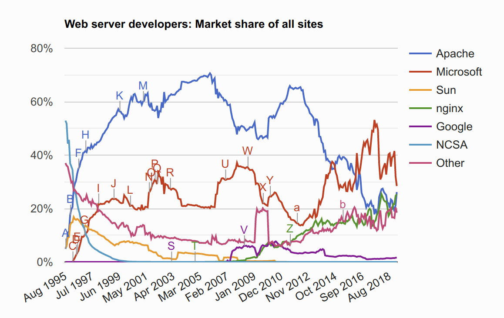
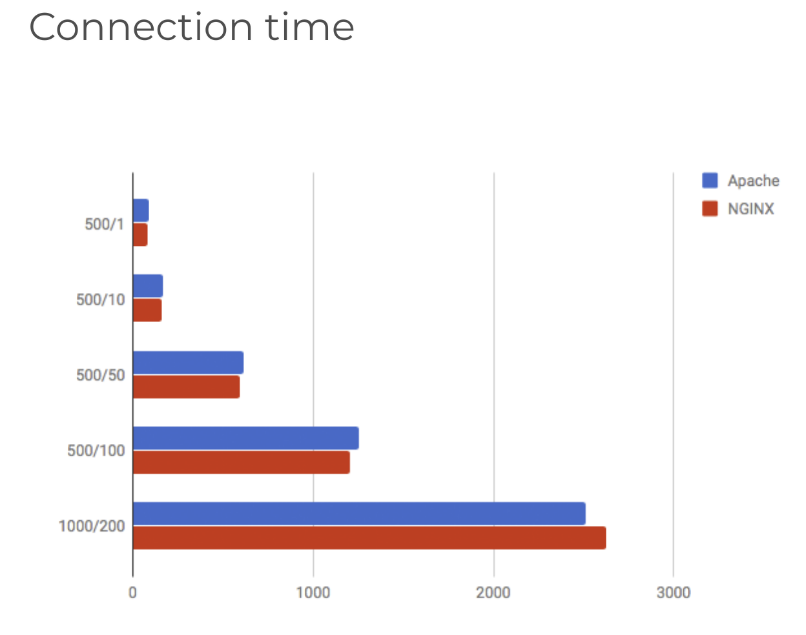
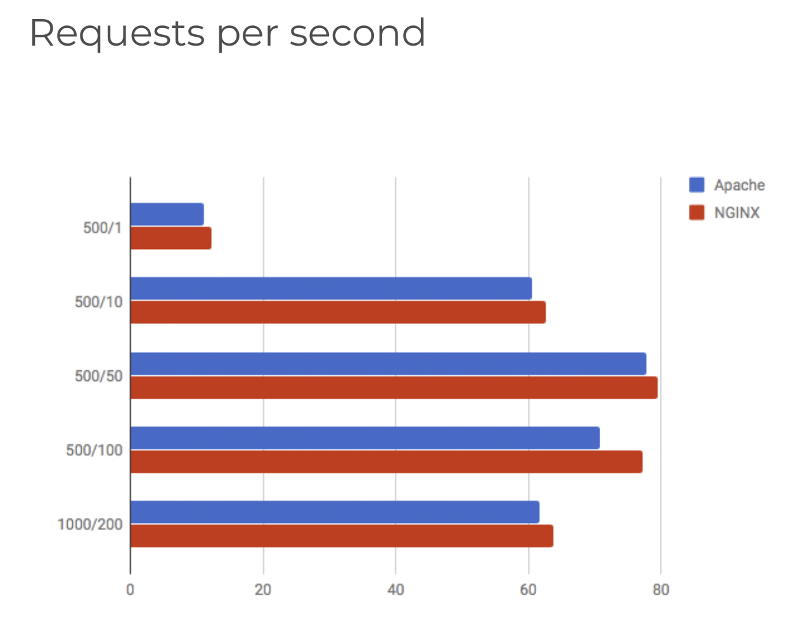
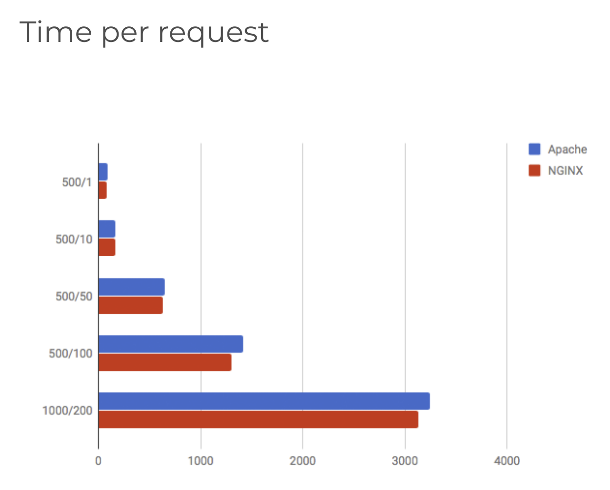
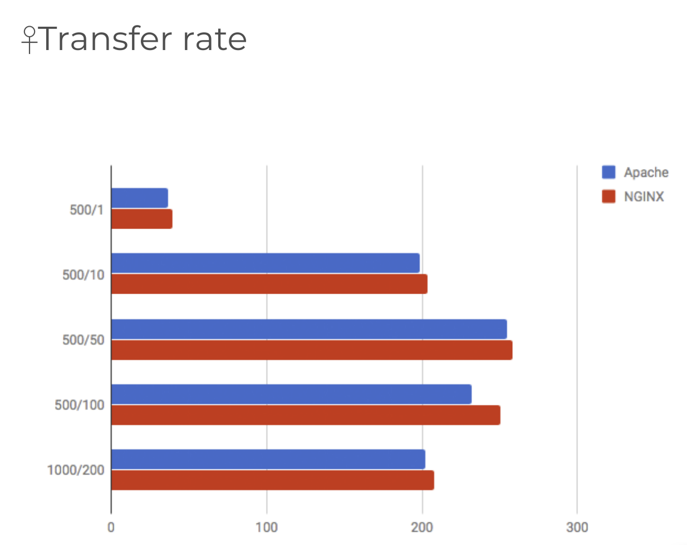

# What is NGINX?

> [Docs](https://www.nginx.com/resources/glossary/nginx/)
>
> [생활코딩 강의](https://opentutorials.org/module/384/3462)

 

 

## Before getting started

 

### Web

- Web이란 인터넷이라는 네트워크 체계 위에서 동작하는 **통신 규약** 중 하나
- Web이 Internet 과 같은 의미처럼 사용되는 이유는 web이 가장 성공한 인터넷 서비스라서!

 

### Server & Client

- `Client` 는 정보를 요청하고, `Server`는 정보를 제공한다!

 

### HTTP

- Web Server와 web client 가 서로 정보를 주고 받기 위한 약속 (**protocol**)
- `Request`는 어떻게 해야하고, 그에 대한 `Response` 는 어떻게 해야하는지에 대한 규칙을 정해둔 것

 

### Web Server

- 다른말로 `HTTP Server` 라고도 부름
- 서버족에서 정보를 제공하는 소프트웨어를 의미
- 대표적인 web server 로는 `Apache` 가 있음

- `NGINX` 는 2007년부터 점점 올라오고 있음!

 

 

## NGINX

- **차세대** web server!
  - `Apache` 의 독주에 제동을 걸고있음!
    - 맘에들어...

- Traffic 이 많은 website를 위해 **확장성**을 위해 설계한 **비동기 이벤트** 기반 구조의 web server

- *더 **적은 자원**으로 더 **빠르게** 데이터를 서비스 할 수 있다!*
  - **경량화**된 web server

 

 

## NGINX vs Apache

- `Apache` 는 web의 산증인이라고 해도 과언이 아님
  - **Open Source** 이고, **무료**로 사용할 수 있는 소프트웨어인 `Apache`가 Web을 지탱하고 있다고 해도 과언이 아님!
- But, `Apache`는 오래전에 만들어진 소프트웨어
  - Apache가 만들어진 시대의 요구사항이 지금 시대에는 유효하지 않은 것이 있을 수 있음
- `NGINX` 는 새로운 시대의 요청에 부응해서 만들어진 web server
  - 개발의 모든 목적이 **높은 성능**에 맞춰져 있음
  - 잘 사용하지 않는 기능은 과감하게 제외했음

 

### Performance comparison

> <https://theorganicagency.com/news/apache-vs-nginx-performance-comparison/>

 

 

 

 

 

### Conclusion

: 대부분의 상황에서 `NGINX`가 `Apache` 보다 더 나은 성능을 보인다!
