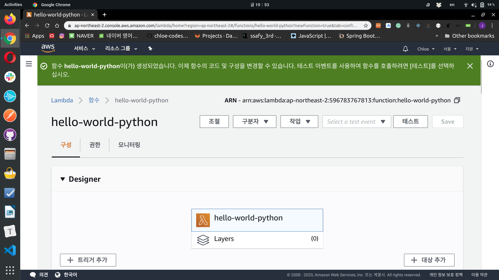

# Getting Started with AWS Lambda

> Everything done in here is free tier eligible

### 1. Run a Serverless "Hello, World!"

 

 

Step 1: Enter the Lambda Console

Step 2: Select a Lambda Blueprint

Step 3: Configure and Create a Lambda Function

Step 4: Invoke Lambda Function and Verify Results

Step 5: Monitor Your Metrics

Step 6: Delete the Lambda Function
