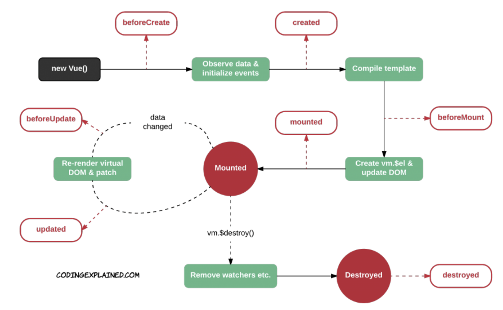

# Vue Intermediate

<br>

### JSONPlaceholder 사용하기

> <https://jsonplaceholder.typicode.com/>

<br>

<br>

### Array concat vs spread operator vs push

> <https://www.measurethat.net/Benchmarks/Show/4223/0/array-concat-vs-spread-operator-vs-push>

<br>

<br>

## Vue instance lifecycle hooks



<br>

<br>

### Scrollmonitor 사용하기

<br>

> cdn

```html
<script src="https://cdn.jsdelivr.net/npm/scrollmonitor@1.2.0/scrollMonitor.min.js"></script>
```

<br>

<br>

## Declarative vs Imperative

<br>

### Declarative (선언형)

> 유산슬을 만들어줘
>
> (대신해서 절차를 수행 -> Framework)

- Vue.js
  - 데이터의 변화에 맞춰 UI를 변경
  - UI 단계  (Hook)
- == django 의 url('/articles') -> views (list_article())
- == JS 코드가 처음 생성 되었을 때 (hook) -> function()

<br>

### Imperative (명령형, 절차적)

> 직접 요리 (언제 / 무엇을)
>
> 레시피 (절차적)

- DOM EventListener

<br>

<br>

## `v-for:key`

- Vue에서 개별 DOM 노드들을 추적하고 기존 엘리먼트를 재사용, 재정렬하기 위해서 `v-for`의 각 항목들에 고유한 key 속성을 제공해야 함
- `v-bind`를 사용하여 동적 값에 바인딩 해야함
- 반복되는 DOM 내용이 단순한 경우나 의도적인 성능 향상을 위해 기본 동작에 의존하지 않는 경우를 제외하면, 가능하면 언제나 `v-for`에 `key`를 추가하는 것이 좋다!

ex)

```html
      <li v-for="todo in todoByStatus()" :key="todo.id :class="{isCompleted: todo.completed}"> 
        <input type="checkbox" v-model="todo.completed">
        {{ todo.content }} 
      </li>
```

<br>

<br>

### 동일한 노드에 `v-for` 와 `v-if` 가 함께 있을 때

- `v-for` 가 `v-if`우선 순위가 높으며, `v-if` 는 매 루프마다 실행된다.
- 하지만 Vue 공식문서에 의하면 두 directive를 함께 사용하는 것을 지양하는 것이 좋다고 한다.
  - `v-if`가 `v-for`를 감싸는 형태로 사용하는 것을 권고한다

<br>

<br>

## `watch` vs `computed`

<br>

- #### `watch (angular)`

  - 데이터 변화를 지켜보는 hook
  - 특정 데이터가 변화 되었을 때, 데이터 변경 & render
  - imperative

- #### `computed`

  - 데이터 변화를 따로 지켜보지 않고,
  - 프레임워크가 데이터가 변화하였을 때, 데이터 변경 & render
  - declarative
    - watch로 쓰면 직접 짜야되는 것을 computed에서는 프레임워크가 해준다!!

<br>

<br>

`+`

## Same Origin Policy & Cross Origin Resource Sharing

> header에 정보가 담겨있음

<br>

### Same Origin Policy

- 같은 Server resource (원천)

<br>

### Cross Origin Resource Sharing (CORS)

- 다른 Source에서 오는 것도 허용 하는 지 여부
