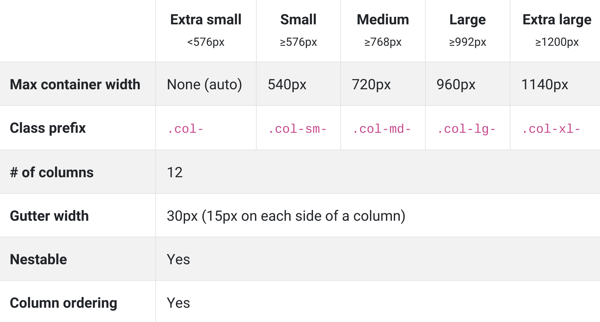

# Responsive Web

<br>

<br>

### Responsive Web Design 이란?

- 사용자가 어떤 device로 web-site를 방문하든 불편없이 이용할 수 있도록 해상도에 따라 가로폭이나 배치를 변경하여 가독성을 높이는 것
  - 하나의 web-site를 구축하여 다양한 device의 화면 해상도에 최적화된 web site를 제공하는 것

<br>


<br>

### 1. viewport meta tag

- `viewport` 란 web page의 가시영역을 의미

  - viewport는 device에 따라 차이가 있음
  - viewport를 이용하여 device 의 특성과 device의 화면 크기 등을 고려하여 각종 device 사용자에게 최적화된 web page를 제공 할 수 있다

- `meta tag`는 browser 또는 **검색엔진최적화(SEO)**를 위해 검색 엔진에게 meta data 를 전달하기 우해 사용됨

  - viewport meta tag는 browser의 화면 설정과 관련된 정보를 제공

    | Property      | Description                      | Usage               |
    | :------------ | :------------------------------- | :------------------ |
    | width         | viewport 너비(px). 기본값: 980px | width=240           |
    |               |                                  | width=device-width  |
    | height        | viewport 높이(px)                | height=800          |
    |               |                                  | width=device-height |
    | initial-scale | viewport초기 배율                | initial-scale=1.0   |
    | user-scale    | 확대 축소 가능 여부              | user-scale=no       |
    | maximum-scale | viewport 최대 배율               | maximum-scale=2.0   |
    | minimum-scale | viewport 최소 배율               | minimum-scale=1.0   |

  - meta tag에서는 *px* 단위를 사용하며 단위 표현은 생략함
  - 여러개의 property를 사용할 때는 쉼표(,)로 구분

  ex)

  ```html
  <meta name="viewport" content="width=device-width, initial-scale=1.0"
  ```

  - 가장 일반적인 viewport 설정
  - 가로 폭을 device 가로 폭에 맞추고 초기 화면 배율을 100%로 설정하는 것

<br>

<br>

### 2. @media

- 서로 다른 media type (print, screen, etc) 에 따라 각각의 styles를 지정하는 것을 가능하게 함
- Responsive Web 에 사용되는 핵심 기술
- `@media` 를 사용하여 media 별로 style을 지정하는 것을 Media Query 라고 함.
  - Device를 지정하는 것뿐만 아니라 device의 크기나 비율까지 구분 가능

<br>

> 일반 화면 (screen)과 인쇄장치 별로 다른 style을 지정하는 예

```html
<!DOCTYPE html>
<html>
<head>
  <meta name="viewport" content="width=device-width, initial-scale=1.0">
  <style>
    @media screen {
      * { color: red; }
    }
    @media print {
      * { color: blue; }
    }
  </style>
</head>
<body>
  <h1>@media practice</h1>
  <p>Lorem ipsum dolor sit amet, consectetur adipisicing elit, sed do eiusmod tempor incididunt ut labore et dolore magna aliqua. Ut enim ad minim veniam, quis nostrud exercitation ullamco laboris nisi ut aliquip ex ea commodo consequat. Duis aute irure dolor in reprehenderit in voluptate velit esse cillum dolore eu fugiat nulla pariatur. Excepteur sint occaecat cupidatat non proident, sunt in culpa qui officia deserunt mollit anim id est laborum.</p>
</body>
</html>
```

<br>

> Media Query 문법

```css
@media not|only mediatype and (expressions) {
  CSS-Code;
}
```

<br>

> Media Query 예시

```css
@media screen and (min-width: 480px) {
  body {
    background-color: lightgreen;
  }
}
```

<br>

| Property            | Description                                              |
| :------------------ | :------------------------------------------------------- |
| width               | viewport 너비(px)                                        |
| height              | viewport 높이(px)                                        |
| device-width        | 디바이스의 물리적 너비(px)                               |
| device-height       | 디바이스의 물리적 높이(px)                               |
| orientation         | 디바이스 방향 (가로 방향: landscape, 세로방향: portrait) |
| device-aspect-ratio | 디바이스의 물리적 width/height 비율                      |
| color               | 디바이스에서 표현 가능한 최대 색상 비트수                |
| monochrome          | 흑백 디바이스의 픽셀 당 비트수                           |
| resolution          | 디바이스 해상도                                          |

<br>

#### Bootstrap Media Query

```css
// Extra small devices (portrait phones, less than 576px)
// No media query for `xs` since this is the default in Bootstrap

// Small devices (landscape phones, 576px and up)
@media (min-width: 576px) { ... }

// Medium devices (tablets, 768px and up)
@media (min-width: 768px) { ... }

// Large devices (desktops, 992px and up)
@media (min-width: 992px) { ... }

// Extra large devices (large desktops, 1200px and up)
@media (min-width: 1200px) { ... }
```

<br>

<br>

## Bootstrap - Layout

<br>

### Grid System

> Bootstrap’s grid system uses a series of containers, rows, and columns to layout and align content.
>
> It’s built with [flexbox](https://developer.mozilla.org/en-US/docs/Web/CSS/CSS_Flexible_Box_Layout/Basic_Concepts_of_Flexbox) and is fully responsive.

<br>

- Grid System은 균형감 있는 layout을 구성하기 위한 방법이며, Bootstrap에서는 반응형으로 layout을 자유롭게 구성할 수 있다.

<br>

Grid System Breakpoint



<br>

- **break point**
  - `.col`, `.col-sm`, `.col-md`, `.col-lg`, `.col-xl`

- `.container`
  - 항상 bootstrap의 grid system을 사용하려면, 상위에 `.container` 가 존재해야 함
  - `.container`
  - `.container-fluid`
- `.row`
  - 12개의 column으로 구성
  - `.col - {breakpoint} - {number}`

<br>

#### 12 column grid

: 12가 나누기 유연한 숫자라서 Bootstrap은 12 column으로 나눈다

<br>

#### Mix and match

> Don’t want your columns to simply stack in some grid tiers? Use a combination of different classes for each tier as needed.

<br>

ex)

```html
<!-- Stack the columns on mobile by making one full-width and the other half-width -->
<div class="row">
  <div class="col-12 col-md-8">.col-12 .col-md-8</div>
  <div class="col-6 col-md-4">.col-6 .col-md-4</div>
</div>

<!-- Columns start at 50% wide on mobile and bump up to 33.3% wide on desktop -->
<div class="row">
  <div class="col-6 col-md-4">.col-6 .col-md-4</div>
  <div class="col-6 col-md-4">.col-6 .col-md-4</div>
  <div class="col-6 col-md-4">.col-6 .col-md-4</div>
</div>

<!-- Columns are always 50% wide, on mobile and desktop -->
<div class="row">
  <div class="col-6">.col-6</div>
  <div class="col-6">.col-6</div>
</div>
```

<br>

#### Gutters

- item들 간의 padding 값

- `.no-gutters` 를 이용하여 없앨 수 있다!

```css
.no-gutters {
  margin-right: 0;
  margin-left: 0;

  > .col,
  > [class*="col-"] {
    padding-right: 0;
    padding-left: 0;
  }
}
```

<br>

#### Offsetting columns

<br>

- Move columns to the right using `.offset-md-*` classes

```html
<div class="row">
  <div class="col-md-4">.col-md-4</div>
  <div class="col-md-4 offset-md-4">.col-md-4 .offset-md-4</div>
</div>
<div class="row">
  <div class="col-md-3 offset-md-3">.col-md-3 .offset-md-3</div>
  <div class="col-md-3 offset-md-3">.col-md-3 .offset-md-3</div>
</div>
<div class="row">
  <div class="col-md-6 offset-md-3">.col-md-6 .offset-md-3</div>
</div>
```

- In addition to column clearing at responsive breakpoints, you may need to reset offsets
  - `.offset-md-0`

```html
<div class="row">
  <div class="col-sm-5 col-md-6">.col-sm-5 .col-md-6</div>
  <div class="col-sm-5 offset-sm-2 col-md-6 offset-md-0">.col-sm-5 .offset-sm-2 .col-md-6 .offset-md-0</div>
</div>

<div class="row">
  <div class="col-sm-6 col-md-5 col-lg-6">.col-sm-6 .col-md-5 .col-lg-6</div>
  <div class="col-sm-6 col-md-5 offset-md-2 col-lg-6 offset-lg-0">.col-sm-6 .col-md-5 .offset-md-2 .col-lg-6 .offset-lg-0</div>
</div>
```

<br>

### @media

> 조건문으로 생각하면 된다!

<br>

```css
@media (min-width: 576px) {
  .container {
    max-width: 540px;
  }
}
```

<br>

#### viewport min width device

<br>

<br>

### Tips

- Bootstrap 설명 보면
  - *Build responsive, **mobile-first** projects on the web with the world’s most popular front-end component library* 라고 써있음
  - 생각을 작은쪽 -> 큰 쪽으로 해라
- height은 contents와 자식요소의영향을 받는다!
