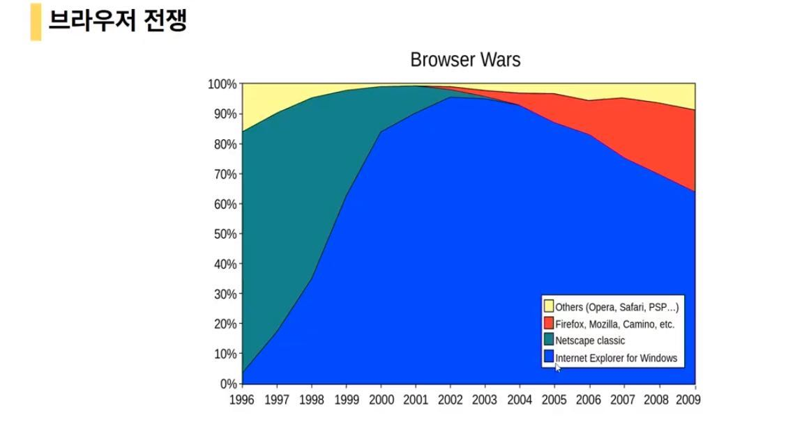

# HTML Basics

<br>

<br>

## 1. HTML 5의 탄생과 의미

<br>

### HTML이란

- **Hyper Text Markup Language**의 약자

  - `Hyper Text`

    - 각 문서마다 연결되는 링크들을 모두 가지고 있는 형태 ( 다양한 문서들로 넘어갈 수 있는 형태)

    - `HTTP`

      : Hyper Text를 주고받는 형태

  - `Markup`

    - 문서의 구조를 잡는 작업을 하는 것

  - Markup Language는 컴퓨터 언어라면 당연히 있어야할 연산 기능이 없고, 단순히 content의 성격을 표시해주는 기능만 있음

  - Web용 content (글/그림) 등의 구조를 지정하는 컴퓨터 언어

- Web server에 저장되어 Client web browser의 요구에 따라 불려지는 문서

- Web browser에 불려진 HTML은 web browser에 의해 해석되어 내용이 화면에 보여짐

<br>

<br>

### HTML 탄생과 발전



- 1990년 WWW (World Wide Web) 과 함께 탄생
- 웹의 발전으로 웹 브라우저의 중요성 확대
- ‘넷스케이프 네비게이터’와 ‘마이크로소프트 인터넷 익스플로러’의 시장 점유율 전쟁으로 HTML과 C
  SS의 비표준 심화
- 새로운 웹 브라우저가 등장하면서 웹의 표준화 논의
- 웹 표준을 개발하고 논의하며 제정하는 W3C(World Wide Web Consortium)
- 1997년 W3C HTML3.2 권고 – 시장 요구에 의해 비표준 HTML 포함
- 1999년 HTML 4.01 권고 – 시장 요구에 의해 다양한 버전 등장
- 2000년 XHTML 권고 – XML의 엄격함을 주요 내용으로 한 웹 표준
- W3C는 XHTML2 개발 추진 하다 돌연 HTML5로 방향 전환

<br>

#### 최근 Web 동향

- `Ajax`

  : JavaScript를 이용하여 web server와 동기화 된 web의 한계 극복

- `Web 2.0`

  : 사용자의 능동적인 참여와 편의성이 극대화 된 web을 통칭

  <br><br>

### HTML5의 탄생

<br>

#### 기존 HTML의 한계

- 웹 기반 사업과 기술의 발전을 못 따라간 HTML

- 동적인 웹을 위한 표준화 된 기술을 요구

- W3C의 XHTML2로의 발전 예고

  <br>

#### WHATWG((Web Hypertext Application Technology Working Group) 탄생

- 시장 요구에 부응하지 못하는 W3C에 실망한 웹 관련 업체와 단체가 자체적으로 만든 워킹 그룹
- 웹 기술과 시장의 요구를 분석하여HTML5
  명세서 작업 착수

<br>

#### W3C의 HTML5 수용

- 2008년 W3C HTML5 초안 발표
- 2009년 XHTML2 개발 중단
- 2014년 XHTML5 권고 예정

<br>

#### HTML5의 특징

- 기존 HTML과의 호환성 유지

- 실용적 설계

  : 느슨한 문법, 효율적인 추가 요소, 안전한 보안

- 표현과 내용의 완벽한 분리

- 플러그인 없이 각종 미디어 처리 및 동적인 작동: 캔버스

- 최신 웹 기술 수용

  : 지오로케이션, 웹소켓, 웹스토리지, 웹워커 등

<br>

<br>

## 2. HTML5 시작하기

<br>

### Doctype 지정하기

- HTML은 여러 버전이 존재하므로Doctype을 명시해야 한다.
- 기존 Doctype 은 매우 길고 복잡한 DTD를 명시해야 했었다.
- HTML5의 실용성 원칙으로 인해 짧아졌다.

```html
 <!DOCTYPE html>
```

<br>

### HTML 작성 규칙

- HTML의 마크업 명령은 **요소**라 부른다.
- HTML은 대소문자를 구분하지 않는다.
- 요소는 콘텐츠와 구분을 위해서 꺽쇠로 둘러싼다. – `태그`

```html
<p>, <a>, <div>
```

- 시작태그와 마침태그로 요소의 범위를 지정한다.

```html
<p>이것은 단락 입니다.</p>
```

- 마침태그가 없이 단독으로 사용되는 요소도 있다.

```html
<br>, , <meta>
```

- 요소의 속성은 속성명 = “속성값” 형식으로 기술한다.

```html

```

<br>

### HTML의 구조

<br>


<br>

```html
<!Doctype html>
<html>
 <head>
        <title>Sample Page</title>
 </head>
 <body>
        <H1>
            Welcome, y'all!
        </H1>
 </body>
</html>
```

- `<html>`은 HTML 코드 전체를 감싼다.
- HTML은 `<head>`와 `<body>` 부분으로 나뉜다.
- `<head>`는 메타데이터와 스크립, CSS등이 위치한다. (외부 파일 연결)
- `<body>`부분은 콘텐츠가 담기는 곳으로 웹 브라우저에 표시된다.

<br>

<br>

## 3. `<head>` 설정

<br>

### 타이틀 지정

- HTML 파일의 제목으로 웹 브라우저 타이틀에 나타난다.

```html
<title>웹 페이지 제목</title>
```

<br>

### 문자 인코딩

- 사용하는 텍스트 에디터의 문자 인코딩과HTML의 문자 인코딩과 동일해야 웹 브라우저에서 옳바르
  게 표시된다.
- 유니코드인 UTF-8로 지정한다.

<br>

### 메타데이터

- 메타데이터를 기술 하면 웹 검색에 유리하다.
- HTML에 대한 정보를 기록할 수 있다.

<br>

### 메타데이터 기술 방법

```html
<meta name="description"content="HTML5 와 Javascript 학습콘텐츠 ">
<meta name="keywords" content="HTML5, CSS, JavaScript">
<meta name="author"content="Lee HaeBum">
<meta name=”copyright” content=”©2012 Lee HaeBum”>
<meta name=”reply-to” content=gomtomi@imacca.com>
<meta name=”date” content=”2012-05-30T12:35:20+09:00”>
```

<br>

### 메타 데이터를 표현하는 새로운 규약, `Open Graph Protocol`

- HTML 문서의 meta data를 통해 문서의 정보 전달
- Facebook에서 만들었으며, meta 정보에 해당하는 제목, 설명 등을 쓸 수 있도록 정의

ex)

```html
<html prefix="og: http://ogp.me/ns#">
<head>
<title>The Rock (1996)</title>
<meta property="og:title" content="The Rock" />
<meta property="og:type" content="video.movie" />
<meta property="og:url" content="http://www.imdb.com/title/tt0117500/" />
<meta property="og:image" content="http://ia.media-imdb.com/images/rock.jpg" />
...
</head>
...
</html>
```

<br>

### [Optional Metadata](https://ogp.me/#optional)

The following properties are optional for any object and are generally recommended:

- `og:audio` - A URL to an audio file to accompany this object.
- `og:description` - A one to two sentence description of your object.
- `og:determiner` - The word that appears before this object's title in a sentence. An [enum](https://ogp.me/#enum) of (a, an, the, "", auto). If `auto` is chosen, the consumer of your data should chose between "a" or "an". Default is "" (blank).
- `og:locale` - The locale these tags are marked up in. Of the format `language_TERRITORY`. Default is `en_US`.
- `og:locale:alternate` - An [array](https://ogp.me/#array) of other locales this page is available in.
- `og:site_name` - If your object is part of a larger web site, the name which should be displayed for the overall site. e.g., "IMDb".
- `og:video` - A URL to a video file that complements this object.

<br>

### Semantic Tag

- HTML에서 의미론적 요소를 담은 tag들의 등장 -  `<div>`를 쓰지 않는다!
- 대표적인 Tag들
  - `header`: 문서 전체나 section의 header (머릿말 부분)
  - `nav`: navigation
  - `aside`: side에 위치한 공간, main content와 관련이 적은 content
  - `section`: 문서, page, site 안에서 독립적으로 구분되는 영역
  - `footer`: 문서 전체나 section의 footer (마지막 부분)
- 개발자 및 사용자 뿐만 아니라 검색엔진 등에 의미 있는 정보의 그룹을 tag로 표현
- 단순히 구역을 나누는 것 뿐만 아니라 의미를 가지는 tag들을 활용하기 위한 노력
- Non-semantic 요소는 `div`, `span` 등이 있으며, `h1`, `table` tag들도 semantic tag로 볼 수 있음
- 검색 엔진 최적화 (SEO : Search Engine Optimizaito) 를 위해서는 **meta tag**, **semantic tag**등을 통한 markup을 효과적으로 할 필요가 있음!

<br>

## 4. 외부 파일 연결

<br>

- HTML과 함께 사용되는 CSS와 자바스크립트는 다른 파일로 분리함이 원칙이다.
- 외부 CSS 파일 연결

```html
<link rel=”stylesheet” href=”css/style.css”>
```

- 외부 자바스크립트 파일 연결

```html
<script src="js/script.js"></script>
```

<br><br>

#### HTML5에서 기존 HTML과 달라진 meta요소와 Empty 요소는?

- meta 요소는 지금까지의 HTML요소와 다르게 시작 요소만을 가지고 맺음 요소는 존재하지 않음
- 기존 HTML 요소가 web browser에 해당 content가 어떤 구조와 의미를 갖는지 알려주는 역할을 했다면 meta 요소는 web browser에게 문서 정보를 알려주는 역할을 함
- 일반적인 HTML 요소가 내용을 감싸는 형식이라면 meta 요소는 속성과 속성 값의 정보를 담고 있을 뿐 내용을 감싸는 것은 아님
  - 그래서 내용을 가지고 있지 않은 요소, 즉 Empty 요소라고 부름
  - Empty 요소에는 `img`, `area`, `br`, `hr`, `input` 등이 있음
