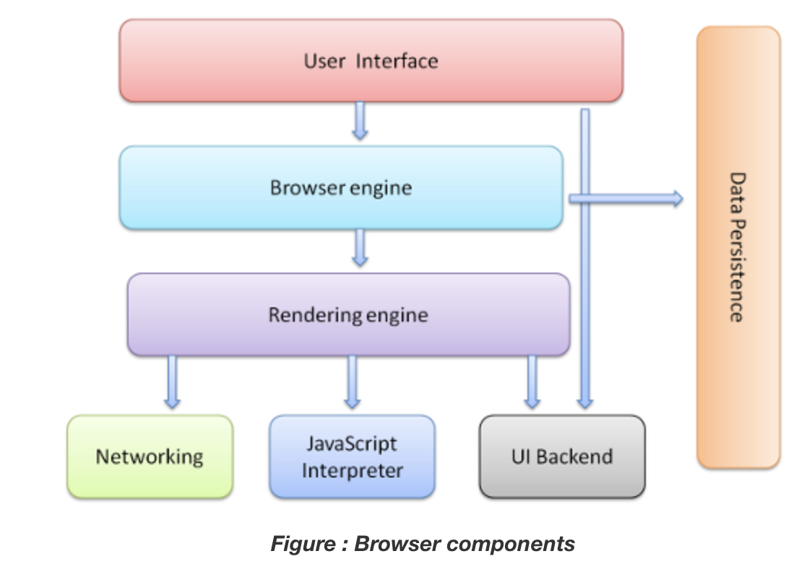
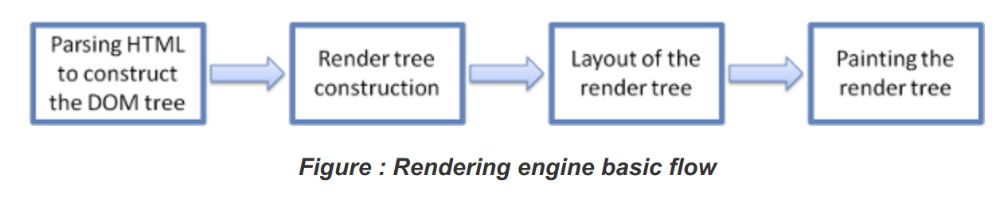
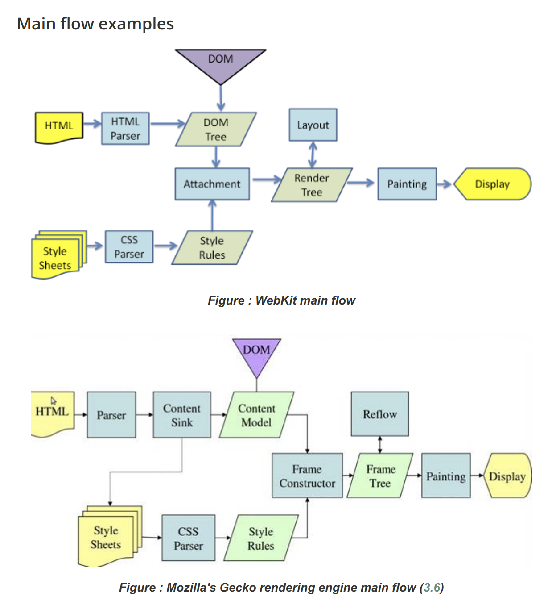

# How Browsers Work

> Back to basics!
>
> Reference: [How Browsers Work: Behind the scenes of modern web browsers](https://www.html5rocks.com/en/tutorials/internals/howbrowserswork/)

 

 

### Browser의 주요 기능

- Browser의 주요 기능은 사용자가 선택한 **resource**을 server에 **요청**하고 browser에 **표시**하는 것이다
  - Resource는 보통 HTML 문서지만, PDF, Image 혹은 다른 형태일 수 있다
  - Resource의 주소는 **URI (Uniform Resource Identifier)**에 의해 정해진다
- Browsesr는 HTML과 CSS의 `명세`에 따라 HTML file을 해석해서 표시한다
  - 명세는 Web 표준화 기구인 **W3C(World Wide Web Consortium)** 에서 정한다
  - 과거에는 browser들이 일부만 이 명세에 따라 구현하고 나머지는 독자적인 방법으로 확장함으로써 심각한 **호환성 문제**를 야기했지만, 현재는 대부분의 browser가 표준 명세를 따른다

 

### Browser의 기본 구조

1. **User Interface**
   - 주소 표시줄, 이전/다음 버튼, Bookmark 등
   - 요청한 page를 보여주는 창을 제외한 나머지 모든 부분
2. **Browser engine**
   - `User Interface`와 `Rendering engine` 사이의 동작을 제어
3. **Rendering engine**
   - 사용자가 요청한 contents를 표시
     - ex) HTML을 요청하면 HTML과 CSS를 parsing 하여 화면에 표시함
4. **Networking**
   - HTTP request와 같은 network 호출에 사용됨
5. **UI Backend**
   - 기본적인 장치를 그린다
   - Platform에서 명시하지 않은 일반적인 interface로서, OS user interface 체계를 사용한다
6. **JavaScript Interpreter**
   - JS code를 해석하고 실행한다
7. **Data Persistence**
   - 자료를 저장하는 계층이다
   - Cookie를 저장하는 것과 같이 모든 종류의 자원을 하드 디스크에 저장할 피룡가 있다
     - HTML5 명세에는 browser가 지원하는 `web database` 가 정의되어 있다

 

 

## The Rendering Engine

- Rendering Engine의 역할은 request를 browser 화면에 표시하는 것이다
- Rendering Engine은 `HTML`, `XML` 문서와 `image`를 표시할 수 있다
  - Plug-in이나 browser 확장 기능을 이용해서 `PDF` 와 같은 다른 유형도 표시할 수 있다

 

### Rendering Engines

이 글에서 다루는 Browser인 **Firefox**, **Chrome**, **Safari**는 두 종류의 Rendering Engine으로 제작되었다

- **Firefox**는 Mozilla에서 직접 만든 `Gecko` Engine을 사용하고,
- **Safari**와 **Chrome**은 `Webkit`  Engine을 사용한다
  - **Webkit**은 최초 Linux Platform에서 동작하기 위해 제작된 open source engine인데,
    - Apple이 Mac과 Windows에서 Safari browser를 지원하기 위해 수정을 가했다.

 

### The main flow

Rendering Engine은 **Network layer**로부터 요청한 contents를 얻는 것으로 시작하는데, 문서의 내용은 보통 8kb 단위로 전송된다

- Rendering Engine은 HTML 문서를 **parsing**하고, "**content tree**" 내부에서 `tag`를 **DOM node**로 변환한다
  - 그 다음 외부 CSS file과 함께 in-line style 요소도 parsing 한다
    - Style 정보와 HTML 표시 규칙은 "**Render tree**" 라고 부르는 또 다른 tree를 생성한다
- **Render tree**는 색상 또는 면적과 같은 **시각적 속성**이 있는 사각형을 포함하고 있는데,  
  - 이들은 **정해진 순서대로** 화면에 표시된다
    - Render tree 생성이 끝나면 **batch**가 시작되는데, 이것은 각 node가 화면의 정확한 위치에 표시되는 것을 의미한다
- 일련의 과정들이 **점진적**으로 진행된다는 것을 아는 것이 중요하다!
  - Rendering engine은 좀 더 나은 사용자 경험을 위해 가능하면 **빠르게** 내용을 표시하는데, 모든 HTML을 parsing 할 때까지 기다리지 않고, **batch**와 **그리기** 과정을 시작한다
    - Network로부터 나머지 content가 전송되기를 기다리면서 받은 내용의 일부를 **먼저** 화면에 표시하는 것이다

